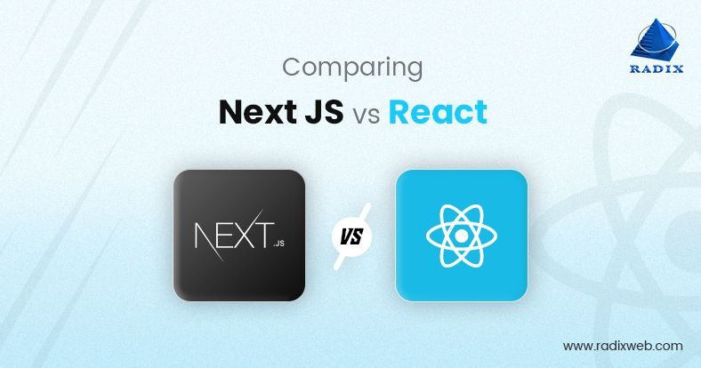

[main]: https://github.com/JaceKim-TheAL/D2505_Nextjs
[][main]

# React vs Next.js

도대체 어떤 플랫폼을 사용할까?  
_"Next JS vs React : Which Framework to choose for Front end in 2025?"_   
궁금하니? 궁금하면 [여기](https://radixweb.com/blog/nextjs-vs-react) 클릭!!!

<h2 id="-nextjs-와-react">🤔 NextJS 와 React</h2>

<strong>NextJS</strong>는 📌 React 기반으로 구축된 보다 단순화된 개발 환경이다.  
러닝커브(learning curve)가 낮지만, 프론트엔드 개발이 처음인 개발자도 빠르게 배울 수 있다. 

Next.js는 React <strong>Framework</strong>인 반면, React는 <strong>JavaScript Library</strong>이다.

**Next.js**는 React `Framework` 인 반면, **React**는 `JavaScript Library` 이다.
