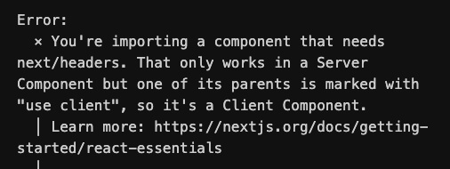

[nextjs15]: readme.md
[][nextjs15]

### INDEX

<table>
  <tr>
    <td><b href="sect_01.md">개요        </b></td>
    <td><a href="sect_02.md">라우팅      </a></td>
    <td><a href="sect_03.md">라우팅 패턴  </a></td>
    <td><a href="sect_04.md">인증        </a></td>
    <td><a href="sect_05.md">서버 액션   </a></td>
    <td><a href="sect_06.md">최적화      </a></td>
    <td><a href="sect_07.md">배포        </a></td>  
    <td><a href="https://nextjs-ko.org/docs/">[공식문서]</a></td>  
  </tr>
</table>

---
# 1. 개요
- [Next.js 15 업데이트](#nextjs-15의-주요-업데이트-내용) 
- [Next.js 소개](#nextjs란)
- [설치 및 구성](#설치-및-구성)  
- - [Prettier](#prettier)
- - [자동 포맷팅 설정](#자동-포맷팅-설정)
- [Server vs Client](#server-vs-client) 

---
### Next.js 15의 주요 업데이트 내용

<ul>
    <li><strong>자동화된 업그레이드 CLI(<code>@next/codemod</code>)</strong><ul>
    <li>Next.js 버전을 쉽게 업그레이드할 수 있는 CLI가 제공됩니다. </li><li><code>npx @next/codemod@canary upgrade latest</code> 명령어로 업그레이드할 수 있습니다.</li><li>상세한 코드 변경까지는 변경이 되지 않아서 추가 확인 작업이 필요합니다.</li></ul>
    </li><li><strong>비동기 요청 API (중요)</strong><ul>
    <li>데이터 요청이 필요 없는 컴포넌트를 비동기로 처리하여 초기 로드 속도를 높이는 방향으로 변경되었습니다.</li><li><code>params</code>나 <code>searchParams</code> 등의 주요 API가 비동기 사용으로 전환되었습니다.</li></ul>
    </li><li><strong>캐싱 기본값 변경 (중요)</strong><ul>
    <li>GET 요청 및 클라이언트 내비게이션의 기본 캐싱 설정이 해제되었습니다.</li><li>TanStack Query 같은 라이브러리의 캐싱 기능과 중복되지 않아서 좋습니다.</li><li><code>cache: 'force-cache'</code> 옵션으로 다시 캐싱할 수 있습니다.</li></ul>
    </li><li><strong>React 19 지원 (중요)</strong><ul>
    <li>React 19와의 호환성을 지원하며, React 18과도 일부 하위 호환이 유지됩니다.</li></ul>
    </li><li><strong><code>&lt;Form&gt;</code> 컴포넌트</strong><ul>
    <li><code>&lt;form&gt;</code> 요소를 확장한 최적화 컴포넌트로, 제출 경로를 프리패칭(Prefetching)하고 제출 데이터를 쿼리스트링으로 보존합니다.</li></ul>
    </li><li><strong>Turbopack Dev 안정화</strong><ul>
    <li><code>next dev --turbo</code> 모드가 안정화되어, 더 빠른 개발 환경과 반응 속도를 제공합니다.</li></ul>
    </li><li><strong>정적 라우트 표시기</strong><ul>
    <li>개발 중에 경로가 사전 렌더링되는지 여부를 화면 하단 모서리에 표시(⚡ Static route)합니다.</li></ul>
    </li><li><strong>비동기 처리 후 코드 실행 API</strong> (<code>unstable_after</code>)<ul>
    <li>스트리밍이 완료된 후 비동기적으로 추가 작업을 처리할 수 있는 새로운 API입니다.</li><li>아직 안정화 전이니 참고만 하는 것이 좋겠습니다.</li></ul>
    </li><li><strong><code>/instrumentation.js</code> API 안정화</strong><ul>
    <li>서버 생명주기를 관찰하여 성능을 모니터링하고 오류를 추적할 수 있습니다.</li></ul>
    </li><li><strong>TypeScript 구성 지원</strong><ul>
    <li>TypeScript를 사용하는 설정 파일을 지원하며 자동 완성과 타입 안전성도 보장됩니다.</li></ul>
    </li><li><strong>자체 호스팅 개선</strong><ul>
    <li>캐시 제어 헤더에 대한 더 많은 제어와 이미지 최적화 성능이 향상되었습니다.</li></ul>
    </li><li><strong>보안 강화</strong><ul>
    <li>서버 액션이 공개 엔드포인트가 되는 것을 방지하기 위한 기능이 추가되어 보안이 강화되었습니다.</li></ul>
    </li><li><strong>외부 패키지 번들링 최적화</strong><ul>
    <li>외부 패키지를 번들링할 수 있는 설정 옵션이 추가되었습니다.</li></ul>
    </li><li><strong>ESLint 9 지원</strong><ul>
    <li>ESLint 9를 지원하여 최신 규칙을 반영하고 호환성을 유지합니다.</li></ul>
    </li><li><strong>빌드 및 개발 성능 개선</strong><ul>
    <li>정적 페이지 생성 최적화와 서버 컴포넌트의 HMR 기능이 강화되었습니다.</li></ul>
    </li>
</ul>
<br/>

[[TOP]](#index)

---
### Next.js란?
<p>
<a href="https://nextjs-ko.org" target="_blank"> Next.js</a>는 <a href="https://vercel.com/" target="_blank">Vercel</a>에서 개발한 React 프레임워크로, 서버 사이드 렌더링(SSR), 클라이언트 사이드 렌더링(CSR), API 라우팅 등의 다양한 최적화 기능을 제공합니다.<br/>
Next.js를 사용하면, <a href="https://react.dev/" target="_blank">React</a>의 기본 기능을 확장해, 보다 빠르고 안정적으로 웹 애플리케이션을 개발할 수 있습니다.
</p>
<br/>

[[TOP]](#index)

---
### 설치 및 구성
<p>
다음 명령으로 Next.js 프로젝트를 설치합니다.<br> 
각 질문에 <code>Yes</code> 또는 <code>No</code>로 답변합니다.
</p>
 
```shell
npx create-next-app@latest <프로젝트이름>
    ✔ Would you like to use TypeScript? … Yes  # 타입스크립트 사용 여부
    ✔ Would you like to use ESLint? … Yes  # ESLint 사용 여부
    ✔ Would you like to use Tailwind CSS? … Yes  # Tailwind CSS 사용 여부
    ✔ Would you like your code inside a `src/` directory? … No  # src/ 디렉토리 사용 여부
    ✔ Would you like to use App Router? (recommended) … Yes  # App Router 사용 여부
    ✔ Would you like to use Turbopack for next dev? … No  # Turbopack 사용 여부
    ✔ Would you like to customize the import alias (@/* by default)? … No  # `@/*` 외 경로 별칭 사용 여부
```
<br/>

#### Prettier
다음 VS Code 확장 프로그램이 설치되어 있어야 합니다.
<ul>
  <li><a href="https://marketplace.visualstudio.com/items?itemName=dbaeumer.vscode-eslint" target="_blank">ESLint</a>: 코드 품질 확인 및 버그, 안티패턴(Anti-pattern)을 감지</li>
  <li><a href="https://marketplace.visualstudio.com/items?itemName=esbenp.prettier-vscode" target="_blank">Prettier - Code formatter</a>: 코드 스타일 및 포맷팅 관리, 일관된 코드 스타일을 적용 가능</li>
</ul>

Prettier 관련 패키지들을 설치합니다.
```shell
npm i -D prettier eslint-config-prettier prettier-plugin-tailwindcss
```

ESLint 구성을 다음과 같이 수정합니다.

**/.eslintrc.json**

```json
{
  "extends": [
    "next/core-web-vitals", 
    "next/typescript", 
    "prettier"
  ]
}
```

<p>
추가로, 프로젝트 루트 경로에 <code>.prettierrc</code> 파일을 생성하고 다음처럼 원하는 규칙을 추가합니다.<br>
자세한 규칙은 <a href="https://prettier.io/docs/en/options" target="_blank">Prettier / Options</a> 에서 확인할 수 있습니다.
</p>

**/.prettierrcJSON**

```json
{
  "semi": false,
  "singleQuote": true,
  "singleAttributePerLine": true,
  "bracketSameLine": true,
  "endOfLine": "lf",
  "trailingComma": "none",
  "arrowParens": "avoid",
  "plugins": ["prettier-plugin-tailwindcss"]
}
```
<br/>

#### 자동 포맷팅 설정
프로젝트의 루트 경로에 .vscode/settings.json 폴더와 파일을 생성해 다음과 같이 내용을 추가할 수 있습니다.

*/.vscode/settings.json*

```json
{
  "editor.formatOnSave": true,
  "editor.defaultFormatter": "esbenp.prettier-vscode"
}
```
<br/>

[[TOP]](#index)

---
### Server vs Client

Next.js에서는 서버 컴포넌트(Server Component)와 클라이언트 컴포넌트(Client Component)를 구분해 코드 일부가 서버 혹은 클라이언트에서 출력될 수 있도록 만들 수 있습니다. <br/>
기본적으로 생성하는 모든 컴포넌트는 서버 컴포넌트입니다! <br/>
클라이언트 컴포넌트로 변경/사용하려면 다음과 같이 컴포넌트 최상단에 'use client' 선언이 필요하고, 해당 선언이 없으면 서버 컴포넌트입니다. <br/>

<p>클라이언트 컴포넌트 또한 일부 정적 요소는 서버에서 렌더링합니다.<br>
따라서 클라이언트 컴포넌트는 '서버 + 클라이언트'의 하이브리드 컴포넌트로 이해해야 합니다!</p>

```tsx
'use client'

export default function Component() {
  return null
}
```
<br/>

서버 컴포넌트와 클라이언트 컴포넌트는 다음과 같이 사용할 수 있는 일부 API가 다릅니다. <br/>
이런 구분을 통해, 서버 컴포넌트에서는 보안이나 캐싱, 성능, SEO 등의 이점을, 클라이언트 컴포넌트에서는 상호작용('click', 'load' 이벤트 등), 브라우저 API(window, document 등) 활용 등의 이점을 얻을 수 있습니다. <br/>

서버 컴포넌트만 사용: <br/>

- cookies
- headers
- redirect
- generateMetadata
- revalidatePath
- ...


클라이언트 컴포넌트만 사용: <br/>

- useState
- useEffect
- onClick
- onChange
- useRouter
- useParams
- useSearchParams
- useFormState
- useOptimistic
- ...
 
각 서버와 클라이언트 컴포넌트에서 서로 맞지 않는 API를 사용하면 다음 이미지와 같이, 바로 에러를 표시하기 때문에 금방 구분할 수 있게 됩니다.
 
<br/>

[[TOP]](#index)

---
