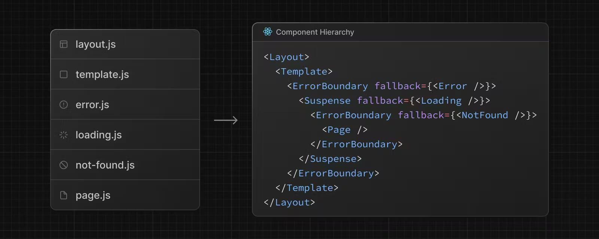
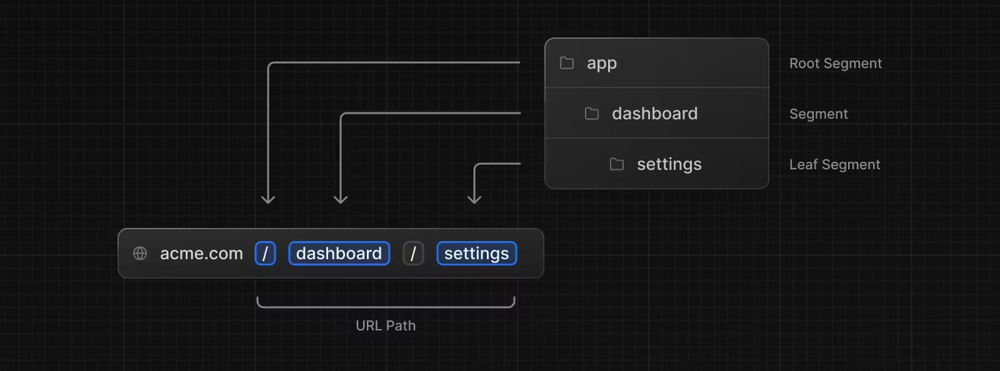
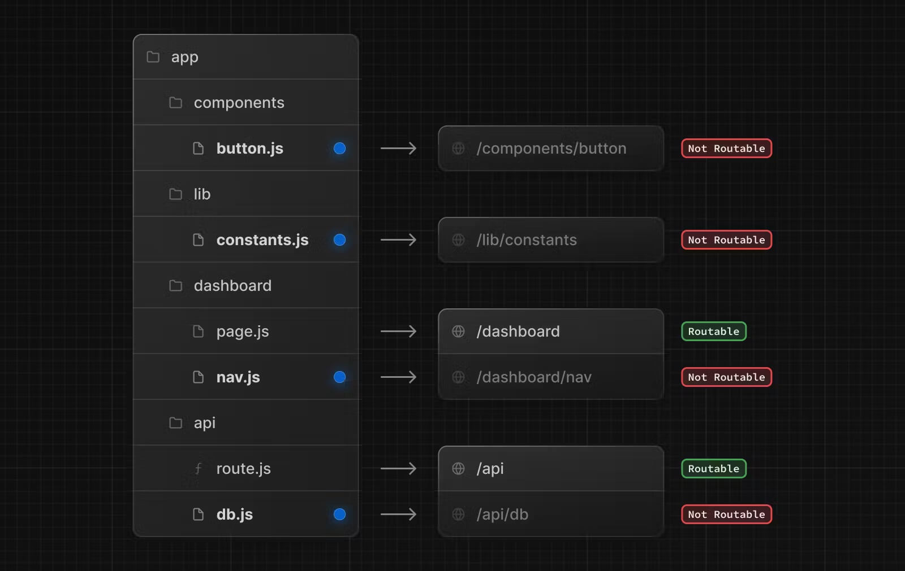

[nextjs15]: https://nextjs-ko.org/docs/
[][nextjs15]  
 
### INDEX

<table>
  <tr>
    <td><a href="sect_01.md">개요        </a></td>
    <td><b href="sect_02.md">라우팅      </b></td>
    <td><a href="sect_03.md">라우팅 패턴  </a></td>
    <td><a href="sect_04.md">인증        </a></td>
    <td><a href="sect_05.md">서버 액션   </a></td>
    <td><a href="sect_06.md">최적화      </a></td>
    <td><a href="sect_07.md">배포        </a></td>  
  </tr>
</table>

---
# 2. 라우팅
- [페이지](#페이지)
- [레이아웃](#레이아웃)
- [컴포넌트 방식의 탐색](#컴포넌트-방식의-탐색)
- [프로그래밍 방식의 탐색](#프로그래밍-방식의-탐색)

<br/>

---
라우팅 기능을 사용하기 위해선 Next.js의 파일 규칙(File Conventions)을 이해해야 합니다. <br/>
기본 파일은 아래 표에서 layout부터 순서대로 계층 구조를 나타내며, 각 페이지를 출력하기 위해 기능에 맞게 사용합니다. <br/>
이러한 명시적 파일 규칙을 통해, 프로젝트 구조를 명확하게 유지할 수 있습니다. <br/>



##### 명시적 컴포넌트 계층 구조(Component Hierarchy)

<table>
    <thead>
        <tr>
            <th>기본 파일</th>
            <th>확장자</th>
            <th>설명</th>
        </tr>
    </thead>
    <tbody>
        <tr>
            <td><code>error</code></td>
            <td><code>.js</code>, <code>.jsx</code>, <code>.tsx</code></td>
            <td>에러 페이지</td>
        </tr>
        <tr>
            <td><code>layout</code></td>
            <td><code>.js</code>, <code>.jsx</code>, <code>.tsx</code></td>
            <td>고정 레이아웃</td>
        </tr>
        <tr>
            <td><code>loading</code></td>
            <td><code>.js</code>, <code>.jsx</code>, <code>.tsx</code></td>
            <td>로딩 페이지</td>
        </tr>
        <tr>
            <td><code>not-found</code></td>
            <td><code>.js</code>, <code>.jsx</code>, <code>.tsx</code></td>
            <td>찾을 수 없는(404) 페이지</td>
        </tr>
        <tr>
            <td><code>page</code></td>
            <td><code>.js</code>, <code>.jsx</code>, <code>.tsx</code></td>
            <td>기본 페이지</td>
        </tr>
        <tr>
            <td><code>template</code></td>
            <td><code>.js</code>, <code>.jsx</code>, <code>.tsx</code></td>
            <td>변화 레이아웃(탐색 시)</td>
        </tr>
    </tbody>
</table>

<table>
    <thead>
        <tr>
            <th>추가 파일</th>
            <th>설명</th>
        </tr>
    </thead>
    <tbody>
        <tr>
            <td><code>default</code></td>
            <td><code>.js</code>, <code>.jsx</code>, <code>.tsx</code></td>
        </tr>
        <tr>
            <td><code>global-error</code></td>
            <td><code>.js</code>, <code>.jsx</code>, <code>.tsx</code></td>
        </tr>
        <tr>
            <td><code>route</code></td>
            <td><code>.js</code>, <code>.ts</code></td>
        </tr>
    </tbody>
</table>


### 페이지
Next.js는 폴더를 사용해 경로를 정의하는 파일 시스템 기반 라우터 방식을 사용하기 때문에, /app 폴더 내에 생성하는 각 폴더는 기본적으로 URL 경로를 의미합니다. <br/>
예를 들어, 프로젝트에 /app/movies 폴더를 생성하면 /movies 경로 즉, http://localhost:3000/movies로 접근할 수 있습니다. <br/>
그리고 접근한 그 경로에서 출력할 내용은 기본적으로 각 폴더의 page.tsx 컴포넌트에 작성합니다. <br/>
 <br/>
이렇게 매핑되는 각 경로 구간을 세그먼트(Segment)라고 합니다. <br/>

세그먼트의 이해 

<br/>

프로젝트 구조
```shell
├─app/
│  ├─movies/
│  │  └─page.tsx
│  └─page.tsx
```
<br/>


http://localhost:3000/ 경로의 페이지 내용
```tsx
[/app/page.tsx]

export default function Home() {
  return <h1>Home page!</h1>
}
```
<br/>

http://localhost:3000/movies 경로의 페이지 내용
```tsx
[/app/movies/page.tsx]

export default function Movies() {
  return (
    <>
      <h1>Movies page!</h1>
      <ul>
        <li>Avengers</li>
        <li>Avatar</li>
        <li>Frozen</li>
      </ul>
    </>
  )
}
```
<br/>

또한 위에서 살펴본 라우팅 파일 규칙에 해당하는 이름이 아닌 파일은, 경로로 정의되지 않기 때문에 같은 폴더 안에서 자유롭게 추가해 사용할 수 있습니다.<br/>
다음 이미지에서 `page.js`, `route.js` 파일을 제외한 나머지 파일은 경로로 정의되지 않습니다.(Not Routable)<br/>

라우팅 파일과 폴더 공유(Colocation)

<br/>

[[TOP]](#index)

---
### 레이아웃

여러 하위 경로에서 공통으로 사용하는 UI는, 각 라우팅 폴더의 layout.tsx 컴포넌트에 작성합니다.<br/>
슬롯(Slot) 방식으로 children Prop을 사용하며, {children} 부분에는 같은 레벨에 있는 page.tsx 컴포넌트를 출력합니다.<br/>
또한 레이아웃은 중첩해서 사용할 수 있습니다.<br/>

프로젝트 구조
```shell
├─app/
│  ├─movies/
│  │  ├─layout.tsx
│  │  └─page.tsx
│  ├─layout.tsx
│  └─page.tsx
├─components/
│  └─Header.tsx
```

<br/>

다음 코드의 {children} 부분에는 /app/page.tsx 컴포넌트가 출력됩니다.<br/>

http://localhost:3000/ 경로의 레이아웃 
```tsx
[/app/layout.tsxTSX]

import './globals.css'
import Header from '@/components/Header'

export default function RootLayout({
  children
}: Readonly<{
  children: React.ReactNode
}>) {
  return (
    <html lang="ko">
      <body className="antialiased">
        <Header />
        <main className="p-2">{children}</main>
      </body>
    </html>
  )
}
```
<br/>

다음 코드의 {children} 부분에는 /app/movies/page.tsx 컴포넌트가 출력됩니다.<br/>
<br/>

http://localhost:3000/movies 경로의 레이아웃
```tsx
[/app/movies/layout.tsx]

export default function MoviesLayout({
  children
}: Readonly<{ children: React.ReactNode }>) {
  return <section>{children}</section>
}
```

<br/>

[[TOP]](#index)

---
### 컴포넌트 방식의 탐색

Next.js에서는 페이지 이동을 위해 <a> 태그가 아닌 <a href="https://nextjs.org/docs/app/getting-started/linking-and-navigating#link-component"><Link> 컴포넌트</a>를 사용합니다. <br/>
<Link> 컴포넌트는 이동하는 페이지 전체를 새로고침하지 않고 최적화된 번들만 일부 로드하거나 서버 렌더링 가능 등의 Next.js 프로젝트 내에서 최적화된 페이지 탐색을 제공합니다. <br/>
위에서 확인한, /components/Header.tsx 컴포넌트에서, 각 페이지로 이동할 수 있는 링크를 추가해봅시다. <br/>

프로젝트 구조
```shell
├─app/
│  ├─movies/
│  │  ├─layout.tsx
│  │  └─page.tsx
│  ├─layout.tsx
│  └─page.tsx
├─components/
│  └─Header.tsx
```
<br/>

```tsx
[/components/Header.tsx]

import Link from 'next/link'

export default function Header() {
  return (
    <header>
      <nav className="flex">
        {links.map(({ href, label }) => (
          <Link
            key={href}
            href={href}
            className="px-2">
            {label}
          </Link>
        ))}
      </nav>
    </header>
  )
}
```

`usePathname` 훅을 사용해 반환되는 현재 경로(`pathname`)와 각 `<Link> 컴포넌트`의 경로를 비교해 현재 페이지인 경우 활성화 스타일을 추가할 수 있습니다.

```tsx
[/components/Header.tsx]

'use client'
import { usePathname } from 'next/navigation'
import Link from 'next/link'

const links = [
  { href: '/', label: 'Home' },
  { href: '/movies', label: 'Movies' }
]

export default function Header() {
  const pathname = usePathname()
  return (
    <header>
      <nav className="flex">
        {links.map(({ href, label }) => (
          <Link
            key={href}
            href={href}
            className={`px-2 ${pathname === href ? 'bg-blue-600 text-white' : ''} `}>
            {label}
          </Link>
        ))}
      </nav>
    </header>
  )
}
```
<br/>

#### 미리 가져오기
<Link /> 컴포넌트는 prefetch 옵션을 통해 뷰포트에 보여질 때, 연결된 경로(href)의 데이터를 미리 가져와 탐색 성능을 크게 향상시킬 수 있습니다. <br/>

- `null`(기본값): 정적 경로인 경우 모든 하위 경로를, 동적 경로인 경우 `loading.tsx`가 있는 가장 가까운 세그먼트까지만 미리 가져옵니다.
- `true`: 정적 경로와 동적 경로 모두 미리 가져옵니다.
- `false`: 미리 가져오지 않습니다.

```tsx
export default function Links() {
  return (
    <>
      <Link href={someLink}>null</Link>
      <Link prefetch={true} href={someLink}>true</Link>
      <Link prefetch={false} href={someLink}>false</Link>
    </>
  )
}
```
<br/>

[[TOP]](#index)

---
### 프로그래밍 방식의 탐색 

상황에 따라 <Link> 컴포넌트를 사용하지 않고, 프로그래밍 방식으로 페이지를 이동해야 할 때가 있습니다. <br/>
그 때는 Next.js에서 제공하는 useRouter 훅(Hook)을 사용해 다음과 같이 페이지 이동을 구현할 수 있습니다. <br/>

```tsx
[/components/Header.tsx]

'use client'
import { usePathname } from 'next/navigation'
import { useRouter } from 'next/navigation'
import Link from 'next/link'

const links = [
  { href: '/', label: 'Home' },
  { href: '/movies', label: 'Movies' }
]

export default function Header() {
  const pathname = usePathname()
  const router = useRouter()
  return (
    <header className="flex items-center">
      <nav className="flex">
        {links.map(({ href, label }) => (
          <Link
            key={href}
            href={href}
            className={`px-2 ${pathname === href ? 'bg-blue-600 text-white' : ''} `}>
            {label}
          </Link>
        ))}
      </nav>
      <button
        className="rounded bg-gray-800 px-2 py-1 text-sm text-white transition-colors hover:bg-gray-700"
        onClick={() => router.push('/movies')}>
        Movies(Push)
      </button>
    </header>
  )
}
```
<br/>

`router 객체`에서는 다음과 같은 메서드를 사용할 수 있습니다.
- push(url): 페이지 이동
- replace(url): 페이지 이동(히스토리에 남지 않음)
- back(): 이전 페이지로 이동
- forward(): 다음 페이지로 이동
- refresh(): 페이지 새로고침
- prefetch(url): 페이지 미리 가져오기
<br/>

#### 미리 가져오기
기본적인 미리 가져오기가 자동으로 동작하는 <Link> 컴포넌트와 달리, 프로그래밍 방식의 탐색에서는 useEffect 훅과 router.prefetch() 메서드를 사용해 미리 가져오기를 구현할 수 있습니다.

```tsx
[/components/Header.tsxTSX]

'use client'
import { useEffect } from 'react'
import { usePathname } from 'next/navigation'
import { useRouter } from 'next/navigation'
import Link from 'next/link'

// 생략..

export default function Header() {
  const pathname = usePathname()
  const router = useRouter()

  useEffect(() => {
    router.prefetch('/movies')
  }, [router])

  return (
    <header className="flex items-center">
      {/* 생략.. */}
      <button
        className="rounded bg-gray-800 px-2 py-1 text-sm text-white transition-colors hover:bg-gray-700"
        onClick={() => router.push('/movies')}>
        Movies(Push)
      </button>
    </header>
  )
}
```

<br/>

[[TOP]](#index)

---
### 동적 경로
미리 정의할 수 없는 동적인 경로는, 대괄호([])를 사용해 폴더 이름을 작성합니다. <br/>
그러면 URL의 세그먼트 값이, params Prop으로 전달되고, 대괄호 사이의 폴더 이름이 속성 이름이 됩니다. <br/>
만약 쿼리스트링(Query String)을 사용하는 경우, searchParams Prop으로 전달됩니다. <br/>
<br/>
프로젝트 구조
```shell
├─app/
│  ├─movies/
│  │  ├─[movieId]/
│  │  │  └─page.tsx
```
<br/>


`params`와 `searchParams`는 모두 Promise 객체입니다.<br/>
서버 컴포넌트인 경우, await 키워드를 사용해 필요한 값을 추출합니다.<br/>

서버 컴포넌트인 경우
```tsx
[/app/movies/[movieId]/page.tsx]

interface Movie {
  Title: string
  Plot: string
}

export default async function MovieDetails({
  params, // 동적 세그먼트
  searchParams // 쿼리스트링
}: {
  params: Promise<{ movieId: string }>
  searchParams: Promise<{ plot?: 'short' | 'full' }>
}) {
  const { movieId } = await params
  const { plot } = await searchParams
  const res = await fetch(`https://omdbapi.com/?apikey=7035c60c&i=${movieId}&plot=${plot || 'short'}`)
  const movie: Movie = await res.json()
  return (
    <>
      <h1>{movie.Title}</h1>
      <p>{movie.Plot}</p>
    </>
  )
}
```
<br/>

클라이언트 컴포넌트인 경우, use 훅을 사용해 필요한 값을 추출합니다.<br/>
<br/>
클라이언트 컴포넌트인 경우 

```tsx
[/app/movies/[movieId]/page.tsx]

'use client'
import { use, useState, useEffect } from 'react'

interface Movie {
  Title: string
  Plot: string
}

export default function MovieDetails({
  params, // 동적 세그먼트
  searchParams // 쿼리스트링
}: {
  params: Promise<{ movieId: string }>
  searchParams: Promise<{ plot?: 'short' | 'full' }>
}) {
  const { movieId } = use(params)
  const { plot } = use(searchParams)
  const [movie, setMovie] = useState<Movie | null>(null)

  useEffect(() => {
    const fetchMovie = async () => {
      const res = await fetch(`https://omdbapi.com/?apikey=7035c60c&i=${movieId}&plot=${plot || 'short'}`)
      const movie: Movie = await res.json()
      setMovie(movie)
    }
    fetchMovie()
  }, [movieId, plot])

  return (
    <>
      <h1>{movie?.Title}</h1>
      <p>{movie?.Plot}</p>
    </>
  )
}
```
<br/>

<Header> 컴포넌트에서 영화 상세 페이지로 이동할 수 있는 링크를 추가해봅시다.

```tsx
[/components/Header.tsx]

// 생략..
const links = [
  { href: '/', label: 'Home' },
  { href: '/movies', label: 'Movies' },
  { href: '/movies/tt4154796', label: 'Movie(Avengers)' }
]

export default function Header() {
  // 생략..
}
```
<br/>

혹은 다음과 같이 직접 URL을 입력해 영화 상세 페이지로 이동해 보세요.

```
http://localhost:3000/movies/tt4520988?plot=full
http://localhost:3000/movies/tt4154796
http://localhost:3000/movies/tt1630029
```
위 URL로 접근해보세요!

<br/>
앞서 살펴본 것처럼 [이름] 폴더로 단순한 동적 경로 일치도 가능하고, 다음 예시와 같이 모든 하위 경로의 동적 일치([...이름])나 선택적 동적 일치([[...이름]]) 패턴도 사용할 수 있습니다. <br/>

<table>
    <thead>
        <tr>
            <th>폴더 구조 예시</th>
            <th>URL 예시</th>
            <th><code>params</code> 값</th>
        </tr>
    </thead>
    <tbody>
        <tr>
            <td><code>app/movies/[hello]/page.tsx</code></td>
            <td><code>/movies/foo</code></td>
            <td><code>{ hello: 'foo' }</code></td>
        </tr>
        <tr>
            <td><code>app/movies/[hello]/page.tsx</code></td>
            <td><code>/movies/bar</code></td>
            <td><code>{ hello: 'bar' }</code></td>
        </tr>
        <tr>
            <td><code>app/movies/[hello]/[world]/page.tsx</code></td>
            <td><code>/movies/foo/bar</code></td>
            <td><code>{ hello: 'foo', world: 'bar' }</code></td>
        </tr>
        <tr>
            <td><code>app/movies/[...hello]/page.tsx</code></td>
            <td><code>/movies/foo</code></td>
            <td><code>{ hello: ['foo'] }</code></td>
        </tr>
        <tr>
            <td><code>app/movies/[...hello]/page.tsx</code></td>
            <td><code>/movies/foo/bar</code></td>
            <td><code>{ hello: ['foo', 'bar'] }</code></td>
        </tr>
        <tr>
            <td><code>app/movies/[...hello]/page.tsx</code></td>
            <td><code>/movies/foo/bar/baz</code></td>
            <td><code>{ hello: ['foo', 'bar', baz] }</code></td>
        </tr>
        <tr>
            <td><code>app/movies/[[...hello]]/page.tsx</code></td>
            <td><code>/movies</code></td>
            <td><code>{}</code></td>
        </tr>
        <tr>
            <td><code>app/movies/[[...hello]]/page.tsx</code></td>
            <td><code>/movies/foo</code></td>
            <td><code>{ hello: ['foo'] }</code></td>
        </tr>
        <tr>
            <td><code>app/movies/[[...hello]]/page.tsx</code></td>
            <td><code>/movies/foo/bar</code></td>
            <td><code>{ hello: ['foo', 'bar'] }</code></td>
        </tr>
    </tbody>
</table>
<br/>

[[TOP]](#index)

---
### 로딩
페이지 출력을 준비하는 동안, 먼저 로딩 상태를 표시할 수 있습니다. <br/>
출력할 페이지와 같은 경로(폴더)에 loading.tsx 파일을 생성합니다. <br/>
<br/>
프로젝트 구조
```shell
├─app/
│  ├─movies/
│  │  ├─[movieId]/
│  │  │  ├─loading.tsx
│  │  │  └─page.tsx
```
<br/>
<br/>
페이지 출력 전 로딩 UI

```tsx
[/app/movies/loading.tsx]

import Loader from '@/components/Loader'

export default function Loading() {
  return <Loader />
}
```

<br/>
<br/>
애니메이션 로딩 UI를 구현하기 위해, 다음과 같이 <Loader> 컴포넌트를 작성합니다. <br/>
<br/>


```tsx
[/components/Loader.tsx]

interface LoaderProps {
  size?: number
  weight?: number
  color?: string
  duration?: number
  className?: string
}

export default function Loader({
  size = 40,
  weight = 4,
  color = '#e96900',
  duration = 1,
  className = ''
}: LoaderProps) {
  return (
    <div
      className={`animate-spin rounded-full ${className} `}
      style={{
        width: size,
        height: size,
        borderWidth: weight,
        borderStyle: 'solid',
        borderColor: color,
        borderTopColor: 'transparent',
        animationDuration: `${duration}s`
      }}
    />
  )
}
```

<br/>
지연 시간을 추가하도록 대기(Delay) 유틸 함수를 작성합니다.

<br/>
대기 유틸 함수

```tsx
[/utils/wait.ts]

export default function wait(ms: number) {
  return new Promise(resolve => setTimeout(resolve, ms))
}
```

<br/>
<br/>
다음과 같이 영화 상세 정보 가져오기를 2초 동안 지연해서 확실히 로딩 UI를 확인하려고 합니다. <br/>
이제 `http://localhost:3000/movies/tt4520988` 페이지로 접근해보세요! <br/>
<br/>
최소 3초 후에 페이지를 출력

```tsx
[/app/movies/[movieId]/page.tsx]

import wait from '@/utils/wait'

export default async function MovieDetails({
  // 생략..
}) {
  const { movieId } = await params
  const { plot } = await searchParams
  await wait(2000)
  const res = await fetch(`https://omdbapi.com/?apikey=7035c60c&i=${movieId}&plot=${plot || 'short'}`)
  // 생략..
}
```

<br/>
<br/>

[[TOP]](#index)

---
### 에러
페이지 출력 중 에러가 발생하면, 에러 상태를 표시할 수 있습니다.<br/>
출력할 페이지와 같은 폴더에 error.tsx 파일을 생성합니다.<br/>
<br/>
프로젝트 구조
```shell
├─app/
│  ├─movies/
│  │  ├─[movieId]/
│  │  │  ├─error.tsx
│  │  │  ├─loading.tsx
│  │  │  └─page.tsx
```
<br/>

*페이지 출력 중 에러 발생 시 UI*

```tsx
[/app/movies/error.tsx]

'use client'
export default function Error({
  error
}: {
  error: Error & { digest?: string }
}) {
  return <h2>{error.message}</h2>
}
```

<br/>
*2초 후에 에러 페이지를 출력*

```tsx
[/app/movies/[movieId]/page.tsx]

import wait from '@/utils/wait'

export default async function MovieDetails({
  // 생략..
}) {
  // 생략..
  await wait(2000)
  throw new Error('뭔가 문제가 있어요..')
  // 생략..
}
```

<br/>

[[TOP]](#index)

---
### 찾을 수 없는 페이지
프로젝트에서 정의하지 않은 경로로 접근하면, not-found.tsx 파일로 별도의 페이지를 출력할 수 있습니다.<br/>

프로젝트 구조

```shell
├─app/
│  └─not-found.tsx
```
<br/>
<br/>
*404 페이지 내용*

```tsx
[/app/not-found.tsx]

import Link from 'next/link'

export default function NotFound() {
  return (
    <>
      <h1 className="text-2xl font-bold">404, 찾을 수 없는 페이지입니다.</h1>
      <Link href="/">메인 페이지로 이동~</Link>
    </>
  )
}
```

<br/>
<br/>

```shell
http://localhost:3000/helloworld12345678
```
위 URL로 접근해보세요!
<br/>

[[TOP]](#index)

---
### 비동기 컴포넌트 스트리밍
다음 예제에서 async/page.tsx 파일은 1초 후에 페이지를 출력하는 비동기 컴포넌트이고, Abc와 Xyz 컴포넌트 또한 각각 2초와 3초 후에 내용을 출력하는 비동기 컴포넌트입니다.<br/>
그러면 http://localhost:3000/async 주소로 접근했을 때, 로딩 애니메이션은 4초 동안 표시되고 그 후에 Abc와 Xyz 컴포넌트가 동시에 출력됩니다.<br/>
Abc 컴포넌트는 2초 만에 출력할 수 있지만, Xyz 컴포넌트의 영향으로 3초 후에 같이 출력됩니다.<br/>
<br/>

*프로젝트 구조*

```shell
├─app/
│  ├─async/
│  │  ├─Abc.tsx
│  │  ├─loading.tsx
│  │  ├─page.tsx
│  │  └─Xyz.tsx
```
<br/>
<br/>
*페이지 출력 전 로딩 UI*

```tsx
[/app/async/loading.tsx]

import Loader from '@/components/Loader'

export default function Loading() {
  return <Loader />
}
```
<br/>
<br/>
*2초 후에 페이지를 출력하는 컴포넌트 Abc*

```tsx
[/app/async/Abc.tsx]

import wait from '@/utils/wait'

export default async function Abc() {
  await wait(2000)
  return <h2>Abc 컴포넌트!</h2>
}
```
<br/>
<br/>
*3초 후에 페이지를 출력하는 컴포넌트 Xyz*

```tsx
[/app/async/Xyz.tsx]

import wait from '@/utils/wait'

export default async function Xyz() {
  await wait(3000)
  return <h2>Xyz 컴포넌트!</h2>
}
```
<br/>
<br/>
*1초 후에 비동기 컴포넌트 Abc와 Xyz를 출력하는 페이지*

```tsx
[/app/async/page.tsx]

import wait from '@/utils/wait'
import Abc from './Abc'
import Xyz from './Xyz'

export default async function Page() {
  await wait(1000)
  return (
    <>
      <h1>비동기 페이지!</h1>
      <Abc />
      <Xyz />
    </>
  )
}
```

<br/>
<br/>
<Header> 컴포넌트에서 비동기 컴포넌트 스트리밍 테스트 페이지로 이동할 수 있게 링크를 추가해봅시다. <br/>

```tsx
[/components/Header.tsx]

// 생략..
const links = [
  { href: '/', label: 'Home' },
  { href: '/movies', label: 'Movies' },
  { href: '/movies/tt4154796', label: 'Movie(Avengers)' },
  { href: '/async', label: 'Async' }
]

export default function Header() {
  // 생략..
}
```

<br/>
<br/>
<Suspense> 컴포넌트를 사용해 비동기 컴포넌트를 스트리밍하면, 각 비동기 컴포넌트가 준비되는 대로 출력할 수 있습니다. <br/>
<Suspense> 컴포넌트에서 fallback Prop을 사용해 각 비동기 컴포넌트의 로딩 UI를 출력할 수도 있습니다. <br/>
다음 예제는 기본 로딩 애니메이션이 1초 동안 표시되고 그 후에 빨간색과 파란색 로딩 애니메이션이 각각 2초와 3초 동안 표시된 후에 Abc와 Xyz 컴포넌트가 출력됩니다. <br/>

<br/>
*비동기 컴포넌트 Abc와 Xyz를 출력하는 페이지*

```tsx
[/app/async/page.tsx]

import { Suspense } from 'react'
import Loader from '@/components/Loader'
import wait from '@/utils/wait'
import Abc from './Abc'
import Xyz from './Xyz'

export default async function Page() {
  await wait(1000)
  return (
    <>
      <h1>비동기 페이지!</h1>
      <Suspense fallback={<Loader color="red" />}>
        <Abc />
      </Suspense>
      <Suspense fallback={<Loader color="blue" />}>
        <Xyz />
      </Suspense>
    </>
  )
}
```
<br/>


[[TOP]](#index)

---