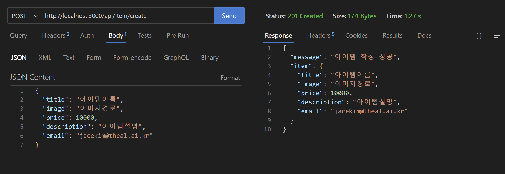
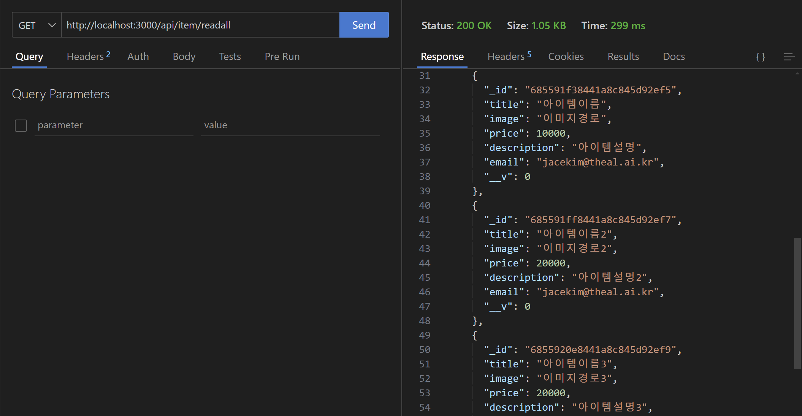
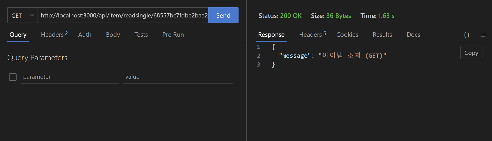
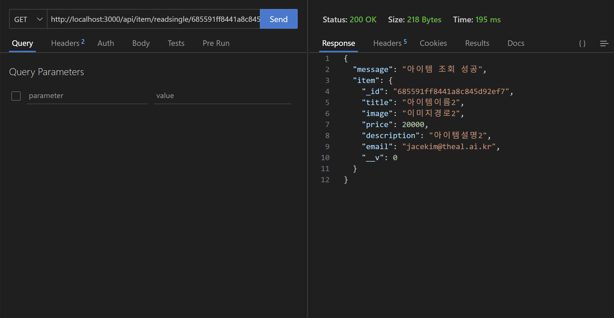
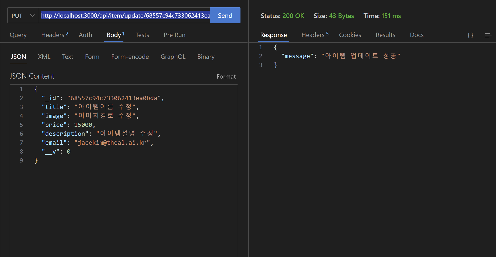
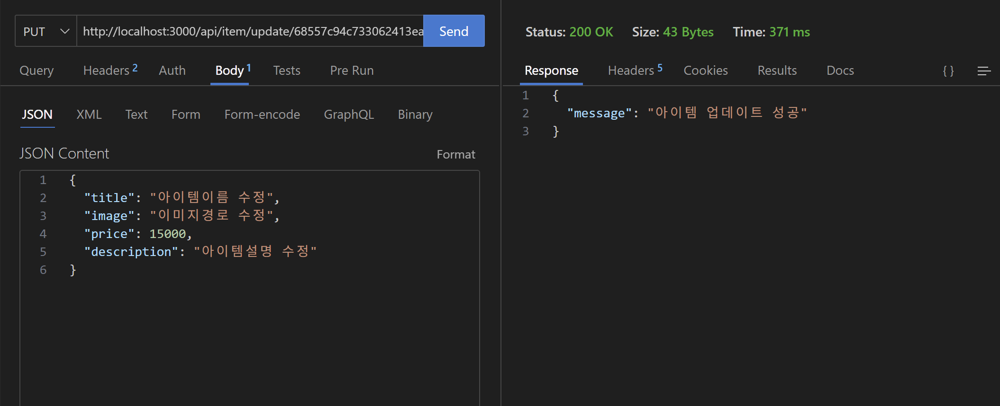
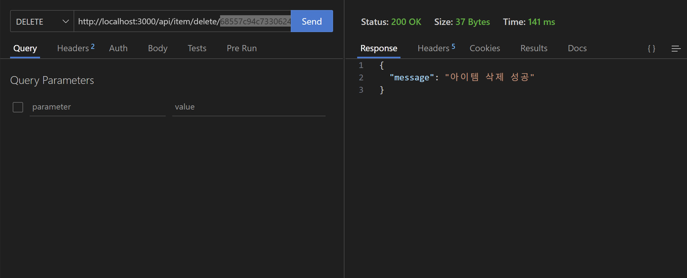

[nextjs15]: readme.md
[][nextjs15]
 
### INDEX

<table>
  <tr>
    <td><a href="small_01.md">1.개발도구   </a></td>
    <td><a href="small_02.md">2.BE준비    </a></td>
    <td><b href="small_03.md">3.B아이템   </b></td>
    <td><a href="small_04.md">4.B사용자   </a></td>
    <td><a href="small_05.md">5.BE배포    </a></td>
    <td><a href="small_06.md">6.FE준비    </a></td>
    <td><a href="small_07.md">7.F사용자   </a></td>
    <td><a href="small_08.md">8.F아이템   </a></td>
    <td><a href="small_09.md">9.FE배포    </a></td>
    <td><a href="small_10.md">10.브러시업  </a></td>
  </tr>
</table>

---
# S03. 아이템 조작기능 
- [아이템 작성1](#아이템-작성1) : 백엔드 작업을 위한 기초작업
- [MongoDB](#mongodb) : NoSQL 데이터베이스
- [아이템 작성2](#아이템-작성2) : 데이터베이스를 설정하고 Next.js를 연결해 데이터를 저장
- [모든 아이템 읽기](#모든-아이템-읽기)
- [하나의 아이템 읽기](#하나의-아이템-읽기)
- [아이템 수정](#아이템-수정)
- [아이템 삭제](#아이템-삭제)

---
### 아이템 작성1
> 백엔드 작업을 위한 기초작업을 한다.

- 템플릿 코드 작성

[app/api/item/create/route.js]
```js
import { NextResponse } from 'next/server';

export async function GET(request) {
  return NextResponse.json({ message: '아이템 작성' });
}
```

확인 : 
http://localhost:3000/api/item/create

```json
{
  "message": "아이템 작성"
}
```

- Thunder Client 에서 아이템 작성
> 아이템 작성을 위해서는 데이터를 받는 단계가 필요
> 데이터는 실제로는 프론트엔드에서 전달되지만 개발단계에서 Thunder Client를 사용
<br/>

[app/api/item/create/route.js]
```js
import { NextResponse } from 'next/server';

export async function GET(request) {
  return NextResponse.json({ message: '아이템 작성 (GET)' })
}

export async function POST(request) {
  console.log(await request.json) 
  return NextResponse.json({ message: '아이템 작성 (POST)' })
}
```
- URL에 어떤 메소드(GET,POST)로 `Send` 하느냐에 따라서, route.js에서 export 되는 함수가 다르다. <br/>
  Response에서 확인!!
- 응답이 NextResponse 인 이유는 Next.js에서만 사용할 수 있는 특별한 코드이기 때문
- request엣 Thunder Client에서 보낸 JSON 데이터가 들어 있을 것이므로, console.log()를 사용해서 확인
- 이를 통해 백엔드에서 데이터를 받는 방법을 알았고, 이후 데이터베이스인 MongoDB 설정과 접속후 데이터 저장을 구현


<br/>

[[TOP]](#index)

---
### MongoDB
MongoDB는 전통적인 RDBMS와는 다른 방식으로 데이터는 저장하는 `NoSQL 데이터베이스` <br/>
<br/>

🧠 MongoDB의 핵심 개념 <br/>
- Document: JSON과 유사한 BSON(Binary JSON) 형식으로 저장되는 데이터 단위
- Collection: 여러 Document를 담는 그릇, RDB의 테이블과 비슷
- Database: 여러 Collection을 포함하는 상위 개념

💡특징 <br/>
- 스키마 유연성: 미리 정해진 구조 없이 다양한 형태의 데이터를 저장 가능
- 확장성: 수평 확장이 쉬워서 대용량 데이터 처리에 유리
- 빠른 읽기/쓰기 성능: 특히 읽기 속도가 빠르고, 인덱스를 다양하게 지원
- 분산 시스템 지원: Replica Set, Sharding 등으로 고가용성과 확장성 확보

🔧 사용 예시 (CRUD) <br/>
```javascript
// Create
db.users.insertOne({ name: "Jace", age: 28 });

// Read
db.users.find({ age: { $gt: 20 } });

// Update
db.users.updateOne({ name: "Jace" }, { $set: { age: 29 } });

// Delete
db.users.deleteOne({ name: "Jace" });
```
<br/>

⚓️ 어디에 쓰이나요? <br/>
- 실시간 분석 시스템
- IoT 데이터 저장
- 사용자 프로필, 게시글, 채팅 로그 등 유연한 구조가 필요한 서비스


🌐 공식사이트 : [[MongoDB Atlas]](https://www.mongodb.com/ko-kr/docs/manual/) <br/>
<table>
  <tr>
    <td>MongoDB</td>
    <td>
      로컬 환경, 즉 로컬 PC안에 데이터를 저장
    </td>
  </tr>
  <tr>
    <td>MongoDB Atlas</td>
    <td>
      클라우드, 즉 온라인에 데이터를 저장
    </td>
  </tr>
</table>
<br/>

⏯ MongoDB 드라이버 연결 <br/>
1. 드라이버와 버전을 선택 : Node.js ver6.7 이상
2. 드라이버 설치 : `npm install mongodb`
3. 연결 문자열을 애플리케이션 코드에 추가
```shell
mongodb+srv://jacekimtheal:<db_password>@cluster-jacekim.8pqgjqy.mongodb.net/?retryWrites=true&w=majority&appName=cluster-jacekim
```
☑ <db_password>를 jacekimtheal 데이터베이스 사용자 의 비밀번호로 바꾸세요. <br/>
☑ 모든 옵션 매개변수가 URL로 인코딩 되었는지 확인하세요 <br/>


<br/>

[[TOP]](#index)

---
### 아이템 작성2
> 데이터베이스를 설정하고 Next.js를 연결해 데이터를 저장한다. 
<br/>

▶️ MongoDB와의 연결 <br/>
- Next.js에서 MongoDB의 연결에서는 이란적으로 mongoose 라는 패키지를 사용
- mongoose를 통해 Schemadhk Model을 쉽게 사용하기 위함
- 패키지 설치

```powershell
npm install mongoose
```
<br/>

[app/utils/database.js]
```js
import mongoose from 'mongoose'

const connectDB = () => {}

export default connectDB
```
- 프론트엔드에서 요청을 받아 응답을 반환하는 처리를 하지는 않으므로 request, NextResponse 등은 없다.
- {} 안에는 이 파일에서 실행할 데이터베이스와 연결 처리를 기술하면 된다. 
<br/>

[app/utils/database.js]
```js
import mongoose from 'mongoose';

const connectDB = () => {
    try {
        mongoose.connect("mongodb+srv://jacekimtheal:<db_password>@cluster-jacekim.8pqgjqy.mongodb.net/?retryWrites=true&w=majority&appName=cluster-jacekim")
        console.log("MongoDB connected successfully");
    } catch (error) {
        console.error("MongoDB connection error:", error);
        throw new Error("Failed to connect to MongoDB");
    }
}

export default connectDB

```
- <db_password>에 등록된 Cluster DB의 비밀번호를 입력
- 연결에 실패했을 때는 console.log()에서 DB연결 실패 메시지를 표시하고,
- throw를 사용해 에러가 발생한 것을 알려준다. 
<br/>

[터미널의 서버구동 console...]
```console
PS C:\GitHub\practice\nextjs\next-market> npm run dev

> next-market@0.1.0 dev
> next dev --turbopack

   ▲ Next.js 15.3.3 (Turbopack)
   - Local:        http://localhost:3000
   - Network:      http://192.168.54.82:3000

 ✓ Starting...
 ✓ Ready in 913ms
 ○ Compiling /api/item/create ...
 ✓ Compiled /api/item/create in 583ms
[Function: bound json]
MongoDB connected successfully
 POST /api/item/create 200 in 1106ms

```
- DE연결에 성공했음을 consol창에서 확인
<br/>

▶️ Schema 생성 <br/>

[app/utils/schemaModels.js]
```js
import mongoose from "mongoose";

const Schema = mongoose.Schema;

const ItemSchema = new Schema({

});
```


```js
import mongoose from "mongoose";
import { title } from "process";

const Schema = mongoose.Schema;

const ItemSchema = new Schema({
    title: { type: String, required: true },
    image: { type: String, required: true },
    price: { type: Number, required: true },
    description: { type: String, required: true },
    email: { type: String, required: true }
});

export const ItemModel = mongoose.models.Item || mongoose.model("Item", ItemSchema);
```
<br/>

[app/api/item/create/route.js]
```js
import { NextResponse } from 'next/server';
import connectDB from '@/app/utils/database';
import { ItemModel } from '../../../utils/schemaModels';

export async function GET(request) {
  return NextResponse.json({ message: '아이템 작성 (GET)' })
}

export async function POST(request) {
  const regBody = await request.json();
  console.log(regBody);

  try {
    // console.log(await request.json())
    await connectDB()                  // 데이터베이스 연결
    await ItemModel.create(regBody)    // 아이템 생성
    // return NextResponse.json({ message: '아이템 작성 성공' })
    return NextResponse.json({ message: '아이템 작성 성공', item: regBody }, { status: 201 });    
  } catch (error) {
    console.error('아이템 작성 중 오류 발생:', error);
    return NextResponse.json({ message: '아이템 작성 실패', error: error.message }, { status: 500 });
  } 
}
```
- await request.json() 는 단 1번만 실행하여야 한다, 중복 호출시 Error 발생!
<br/>


▶️ Item작성 테스트

- VS Code의 좌측에 번개모양(Thunder Client) 이모티콘을 클릭
- New Request 를 클릭

[POST] http://localhost:3000/api/item/create 
<br/>

[Body / JSON] <br/>
```json
{
  "title": "아이템이름",
  "image": "이미지경로",
  "price": 10000,
  "description": "아이템설명",
  "email": "jacekim@theal.ai.kr"
}
```



```console
PS C:\GitHub\practice\nextjs\next-market> npm run dev

> next-market@0.1.0 dev
> next dev --turbopack

   ▲ Next.js 15.3.3 (Turbopack)
   - Local:        http://localhost:3000
   - Network:      http://192.168.54.82:3000

 ✓ Starting...
 ✓ Ready in 954ms
 ○ Compiling /api/item/create ...
 ✓ Compiled /api/item/create in 598ms
{
  title: '아이템이름',
  image: '이미지경로',
  price: 10000,
  description: '아이템설명',
  email: 'jacekim@theal.ai.kr'
}
MongoDB connected successfully
 POST /api/item/create 201 in 1266ms

```
<br/>

[[TOP]](#index)

---
### 모든 아이템 읽기
> 읽기 기능을 구현
<br/>

[app/api/item/readall/route.js]
```js
import { NextResponse } from 'next/server';
import connectDB from '@/app/utils/database';

export async function GET(request) {
  connectDB();
  // 데이터베이스 연결은 connectDB() 함수에서 처리되므로, 여기서는 별도로 처리할 필요 없음.
  // 데이터베이스에서 아이템을 읽어오는 로직을 추가해야 합니다.
  // 예시로, ItemModel.find()를 사용하여 모든 아이템을 가져올 수 있습니다.
  // const items = await ItemModel.find({});
  // return NextResponse.json({ items }, { status: 200 });
  // 현재는 단순히 메시지를 반환합니다.
    
  return NextResponse.json({ message: 'Read All Item' }, { status: 405 });
}
```
- 데이터를 읽기 위해서는 먼저 DB와 연결
- 읽기 조작이 전부이므로 POST가 아니라 GET을 사용
<br/>


[app/api/item/readall/route.js]
```js
import { NextResponse } from 'next/server';
import connectDB from '@/app/utils/database';
import { ItemModel } from '../../../utils/schemaModels';

export async function GET(request) {
  try {
    await connectDB(); // 데이터베이스 연결
    const items = await ItemModel.find({}); // 모든 아이템 조회
    return NextResponse.json({ message: '아이템 조회 성공', items }, { status: 200 });
  } catch (error) {
    console.error('아이템 조회 중 오류 발생:', error);
    return NextResponse.json({ message: '아이템 조회 실패', error: error.message }, { status: 500 });
  }
}
```
- ModgoDB에서 데이터 읽기를 수행하는 기능은 Model 안에 있으므로 ItemModel을 임포트

<br/>




<br/>

[[TOP]](#index)

---
### 하나의 아이템 읽기
> 얼핏 간단하게 보이는 '하나의 아이템 읽기' 처리에는 사실 주의해야할 점이 있다.
<br/>

[app/api/item/readsingle/[id]/route.js]
```js
import { NextResponse } from 'next/server';
import connectDB from '@/app/utils/database';

export async function GET(request, { params }) {
    try {
        await connectDB(); // 데이터베이스 연결
        return NextResponse.json({ message: '아이템 조회 (GET)' });
    } catch (error) {
        return NextResponse.json({ message: '아이템 조회 실패', error: error.message }, { status: 500 });
    }
}

```
- 하나의 아이템은 [id]폴더 아래에 route.js를 생성


TEST URL : http://localhost:3000/api/item/readsingle/68557bc7fdbe2baa27736334


<br/>

[app/api/item/readsingle/[id]/route.js]
```js
import { NextResponse } from 'next/server';
import connectDB from '@/app/utils/database';
import { ItemModel } from '../../../../utils/schemaModels';

export async function GET(request, { params }) {
    const { id } = params; // URL 파라미터에서 id 추출
    try {
        await connectDB(); // 데이터베이스 연결
        const item = await ItemModel.findById(id); // 아이템 ID로 조회
        if (!item) {
            return NextResponse.json({ message: '아이템을 찾을 수 없습니다.' }, { status: 404 });
        }
        return NextResponse.json({ message: '아이템 조회 성공', item }, { status: 200 });
    } catch (error) {
        console.error('아이템 조회 중 오류 발생:', error);
        return NextResponse.json({ message: '아이템 조회 실패', error: error.message }, { status: 500 });
    }
}
```
- schemaModels 모델 import 할때 [id] 폴더로 depth를 잘 확인할 것!!!


TEST URL : http://localhost:3000/api/item/readsingle/685591ff8441a8c845d92ef7


<br/>

결과 : http://localhost:3000/api/item/readsingle/685591ff8441a8c845d92ef7
```json
{
  "message": "아이템 조회 성공",
  "item": {
    "_id": "685591ff8441a8c845d92ef7",
    "title": "아이템이름2",
    "image": "이미지경로2",
    "price": 20000,
    "description": "아이템설명2",
    "email": "jacekim@theal.ai.kr",
    "__v": 0
  }
}
```
<br/>

[[TOP]](#index)

---
### 아이템 수정
> 수정 작업은 지금까지 만든 작성하기와 읽기의 처리를 조합한 것
<br/>

[app/api/item/update/[id]/route.js] --- 미완성!!!
```js
import { NextResponse } from 'next/server';
import connectDB from '@/app/utils/database';
import { ItemModel } from '../../../../utils/schemaModels';

export async function PUT(request, context) {
    const regBody = await request.json();

    try {
        await connectDB(); // 데이터베이스 연결
        await ItemModel.updateOne(
            { _id: regBody.id }, // 아이템 ID로 조회
            { $set: { title: regBody.title, price: regBody.price, description: regBody.description } } // 업데이트할 필드
        );
        return NextResponse.json({ message: '아이템 업데이트 성공' }, { status: 200 });
    } catch (error) {
        console.error('아이템 업데이트 중 오류 발생:', error);
        return NextResponse.json({ message: '아이템 업데이트 실패', error: error.message }, { status: 500 });
    }
}
```
- Update 이므로 PUT 방식으로 처리 


- message는 업데이트 성공라고 뜨는데, 실제 데이터는 그대로??
<br/>
<br/>

[app/api/item/update/[id]/route.js] 
```js
import { NextResponse } from 'next/server';
import connectDB from '@/app/utils/database';
import { ItemModel } from '../../../../utils/schemaModels';

export async function PUT(request, { params }) {
    const { id } = params; // URL 파라미터에서 id 추출
    const reqBody = await request.json();
    try {
        await connectDB(); // 데이터베이스 연결
        await ItemModel.updateOne(
            { _id: id },      // 아이템 ID로 조회
            { $set: reqBody } // 요청 본문으로 업데이트
        );
        return NextResponse.json({ message: '아이템 업데이트 성공' }, { status: 200 });
    } catch (error) {
        console.error('아이템 업데이트 중 오류 발생:', error);
        return NextResponse.json({ message: '아이템 업데이트 실패', error: error.message }, { status: 500 });
    }
}
```

[PUT] http://localhost:3000/api/item/update/68557c94c733062413ea0bda
<br/>

[Body / JSON] <br/>
```json
{
  "title": "아이템이름 수정",
  "image": "이미지경로 수정",
  "price": 15000,
  "description": "아이템설명 수정"
}
```
- JSON값에 대한 오류 검토, 특히 마지막 항목에 쉼표(,) 붙히면 오류!!



- 결과확인 : http://localhost:3000/api/item/readsingle/68557c94c733062413ea0bda
```json
{
  "message": "아이템 조회 성공",
  "item": {
    "_id": "68557c94c733062413ea0bda",
    "title": "아이템이름 수정",
    "image": "이미지경로 수정",
    "price": 15000,
    "description": "아이템설명 수정",
    "email": "jacekim@theal.ai.kr",
    "__v": 0
  }
}
```
<br/>

[[TOP]](#index)

---
### 아이템 삭제
> 삭제하기의 흐름은 수정하기와 거의 같음
<br/>

[app/api/item/delete/[id]/route.js] 
```js
import { NextResponse } from "next/server";
import connectDB from "@/app/utils/database";
import { ItemModel } from "../../../../utils/schemaModels";

export async function DELETE(request, { params }) {
    const { id } = params; // URL 파라미터에서 id 추출
    try {
        await connectDB(); // 데이터베이스 연결
        const result = await ItemModel.deleteOne({ _id: id }); // 아이템 ID로 삭제
        if (result.deletedCount === 0) {
            return NextResponse.json({ message: "아이템이 존재하지 않습니다." }, { status: 404 });
        }
        return NextResponse.json({ message: "아이템 삭제 성공" }, { status: 200 });
    } catch (error) {
        console.error("아이템 삭제 중 오류 발생:", error);
        return NextResponse.json({ message: "아이템 삭제 실패", error: error.message }, { status: 500 });
    }
}
```
<br/>

- 삭제전 리스트 : http://localhost:3000/api/item/readall
<pre>
{
  "message":"아이템 조회 성공",
  "items":
    [
      {"_id":"68557c94c733062413ea0bda","title":"아이템이름 수정","image":"이미지경로 수정","price":15000,"description":"아이템설명 수정","email":"jacekim@theal.ai.kr","__v":0},
      {"_id":"685591f38441a8c845d92ef5","title":"아이템이름","image":"이미지경로","price":10000,"description":"아이템설명","email":"jacekim@theal.ai.kr","__v":0},
      {"_id":"685591ff8441a8c845d92ef7","title":"아이템이름2","image":"이미지경로2","price":20000,"description":"아이템설명2","email":"jacekim@theal.ai.kr","__v":0},
      {"_id":"6855920e8441a8c845d92ef9","title":"아이템이름3","image":"이미지경로3","price":20000,"description":"아이템설명3","email":"jacekim@theal.ai.kr","__v":0}
    ]
}
</pre>
<br/>



<br/>
- 삭제후 리스트 : http://localhost:3000/api/item/readall
<pre>
{
  "message":"아이템 조회 성공",
  "items":
    [
      {"_id":"685591f38441a8c845d92ef5","title":"아이템이름","image":"이미지경로","price":10000,"description":"아이템설명","email":"jacekim@theal.ai.kr","__v":0},
      {"_id":"685591ff8441a8c845d92ef7","title":"아이템이름2","image":"이미지경로2","price":20000,"description":"아이템설명2","email":"jacekim@theal.ai.kr","__v":0},
      {"_id":"6855920e8441a8c845d92ef9","title":"아이템이름3","image":"이미지경로3","price":20000,"description":"아이템설명3","email":"jacekim@theal.ai.kr","__v":0}
    ]
}
</pre>
<br/>

[[TOP]](#index)

---
