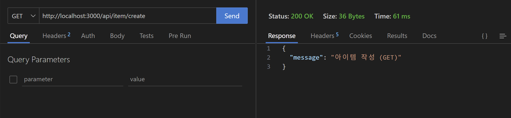
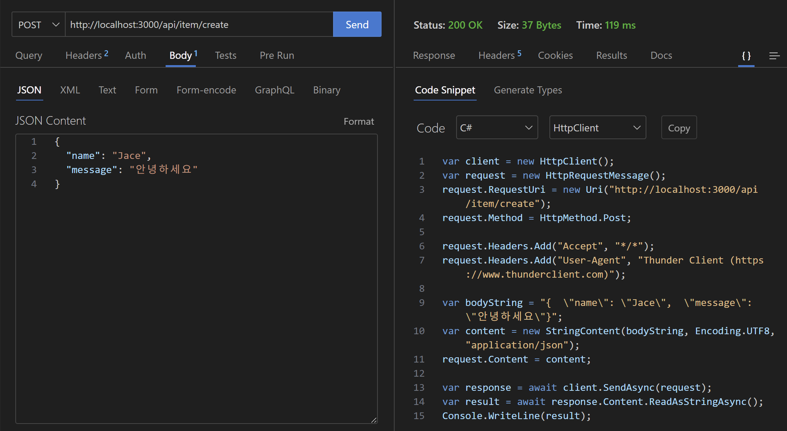

[nextjs15]: readme.md
[][nextjs15]
 
### INDEX

<table>
  <tr>
    <td><a href="small_01.md">1.개발도구   </a></td>
    <td><a href="small_02.md">2.BE준비    </a></td>
    <td><b href="small_03.md">3.B아이템   </b></td>
    <td><a href="small_04.md">4.B사용자   </a></td>
    <td><a href="small_05.md">5.BE배포    </a></td>
    <td><a href="small_06.md">6.FE준비    </a></td>
    <td><a href="small_07.md">7.F사용자   </a></td>
    <td><a href="small_08.md">8.F아이템   </a></td>
    <td><a href="small_09.md">9.FE배포    </a></td>
    <td><a href="small_10.md">10.브러시업  </a></td>
  </tr>
</table>

---
# S03. 아이템 조작기능 
- [아이템 작성1](#아이템-작성1) : 백엔드 작업을 위한 기초작업
- [MongoDB](#mongodb) : NoSQL 데이터베이스
- [아이템 작성2](#아이템-작성2) : 데이터베이스를 설정하고 Next.js를 연결해 데이터를 저장
- []

---
### 아이템 작성1
> 백엔드 작업을 위한 기초작업을 한다.

- 템플릿 코드 작성

[app/api/item/create/route.js]
```js
import { NextResponse } from 'next/server';

export async function GET(request) {
  return NextResponse.json({ message: '아이템 작성' });
}
```

확인 : 
http://localhost:3000/api/item/create

```json
{
  "message": "아이템 작성"
}
```

- Thunder Client 에서 아이템 작성
> 아이템 작성을 위해서는 데이터를 받는 단계가 필요
> 데이터는 실제로는 프론트엔드에서 전달되지만 개발단계에서 Thunder Client를 사용
<br/>

[app/api/item/create/route.js]
```js
import { NextResponse } from 'next/server';

export async function GET(request) {
  return NextResponse.json({ message: '아이템 작성 (GET)' })
}

export async function POST(request) {
  console.log(await request.json) 
  return NextResponse.json({ message: '아이템 작성 (POST)' })
}
```
- URL에 어떤 메소드(GET,POST)로 `Send` 하느냐에 따라서, route.js에서 export 되는 함수가 다르다. <br/>
  Response에서 확인!!
- 응답이 NextResponse 인 이유는 Next.js에서만 사용할 수 있는 특별한 코드이기 때문
- request엣 Thunder Client에서 보낸 JSON 데이터가 들어 있을 것이므로, console.log()를 사용해서 확인
- 이를 통해 백엔드에서 데이터를 받는 방법을 알았고, 이후 데이터베이스인 MongoDB 설정과 접속후 데이터 저장을 구현






<br/>

[[TOP]](#index)

---
### MongoDB
MongoDB는 전통적인 RDBMS와는 다른 방식으로 데이터는 저장하는 `NoSQL 데이터베이스` <br/>
<br/>

🧠 MongoDB의 핵심 개념 <br/>
- Document: JSON과 유사한 BSON(Binary JSON) 형식으로 저장되는 데이터 단위
- Collection: 여러 Document를 담는 그릇, RDB의 테이블과 비슷
- Database: 여러 Collection을 포함하는 상위 개념

💡특징 <br/>
- 스키마 유연성: 미리 정해진 구조 없이 다양한 형태의 데이터를 저장 가능
- 확장성: 수평 확장이 쉬워서 대용량 데이터 처리에 유리
- 빠른 읽기/쓰기 성능: 특히 읽기 속도가 빠르고, 인덱스를 다양하게 지원
- 분산 시스템 지원: Replica Set, Sharding 등으로 고가용성과 확장성 확보

🔧 사용 예시 (CRUD) <br/>
```javascript
// Create
db.users.insertOne({ name: "Jace", age: 28 });

// Read
db.users.find({ age: { $gt: 20 } });

// Update
db.users.updateOne({ name: "Jace" }, { $set: { age: 29 } });

// Delete
db.users.deleteOne({ name: "Jace" });
```
<br/>

⚓️ 어디에 쓰이나요? <br/>
- 실시간 분석 시스템
- IoT 데이터 저장
- 사용자 프로필, 게시글, 채팅 로그 등 유연한 구조가 필요한 서비스


🌐 공식사이트 : [[MongoDB Atlas]](https://www.mongodb.com/ko-kr/docs/manual/) <br/>
<table>
  <tr>
    <td>MongoDB</td>
    <td>
      로컬 환경, 즉 로컬 PC안에 데이터를 저장
    </td>
  </tr>
  <tr>
    <td>MongoDB Atlas</td>
    <td>
      클라우드, 즉 온라인에 데이터를 저장
    </td>
  </tr>
</table>
<br/>

⏯ MongoDB 드라이버 연결 <br/>
1. 드라이버와 버전을 선택 : Node.js ver6.7 이상
2. 드라이버 설치 : `npm install mongodb`
3. 연결 문자열을 애플리케이션 코드에 추가
```shell
mongodb+srv://jacekimtheal:<db_password>@cluster-jacekim.8pqgjqy.mongodb.net/?retryWrites=true&w=majority&appName=cluster-jacekim
```
☑ <db_password>를 jacekimtheal 데이터베이스 사용자 의 비밀번호로 바꾸세요. <br/>
☑ 모든 옵션 매개변수가 URL로 인코딩 되었는지 확인하세요 <br/>


<br/>

[[TOP]](#index)

---
### 아이템 작성2
> 데이터베이스를 설정하고 Next.js를 연결해 데이터를 저장한다. 
<br/>

- MongoDB와의 연결

Next.js에서 MongoDB의 연결에서는 이란적으로 mongoose 라는 패키지를 사용
mongoose를 통해 Schemadhk Model을 쉽게 사용하기 위함
패키지 설치

```powershell
npm install mongoose
```


[[TOP]](#index)

---
<br/>

[[TOP]](#index)

---
