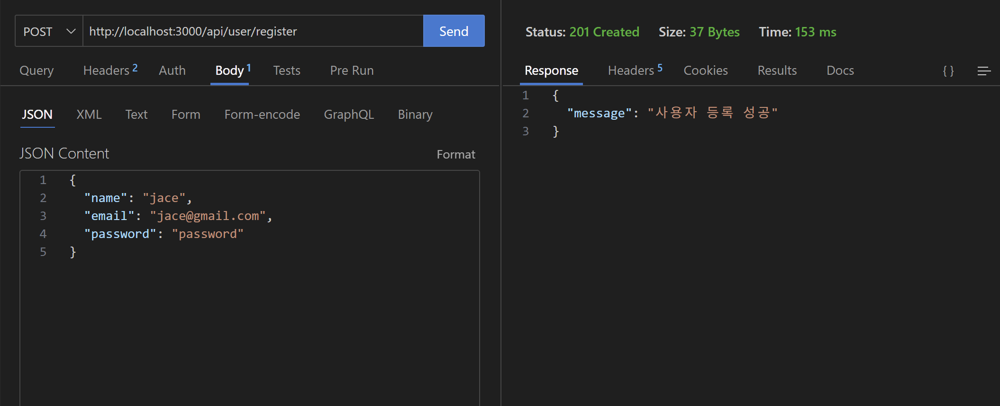

[nextjs15]: readme.md
[][nextjs15]
 
### INDEX

<table>
  <tr>
    <td><a href="small_01.md">1.개발도구   </a></td>
    <td><a href="small_02.md">2.BE준비    </a></td>
    <td><a href="small_03.md">3.B아이템   </a></td>
    <td><b href="small_04.md">4.B사용자   </b></td>
    <td><a href="small_05.md">5.BE배포    </a></td>
    <td><a href="small_06.md">6.FE준비    </a></td>
    <td><a href="small_07.md">7.F사용자   </a></td>
    <td><a href="small_08.md">8.F아이템   </a></td>
    <td><a href="small_09.md">9.FE배포    </a></td>
    <td><a href="small_10.md">10.브러시업  </a></td>
  </tr>
</table>

---
# S04. 사용자관리 및 로그인
- [사용자 등록 기능](#사용자-등록-기능)
- [로그인 기능](#로그인-기능)
- [로그인 상태 유지](#로그인-상태-유지)
- [사용자 로그인 상태 판정 기능](#사용자-로그인-상태-판정-기능)
- [로그인한 사용자 판정 기능](#로그인한-사용자-판정-기능)

---
### 사용자 등록 기능
> 등록 기능을 만드는 방법과 제약을 부여하는 Schema 작성 방법 소개
<br/>

▶️ USER 스키마 추가 <br/>
- 흐름자체는 아이템 데이터 작성하기와 유사
- 아이템 데이터가 아니라 사용자 데이터이므로, 새로운 Schema와 Model이 필요
- 사용자 데이터로 사용자이름, 이메일주소, 비밀번호 3가지를 저장

[app/utils/schemaModels.js]
```js
import mongoose from "mongoose";
import { title } from "process";

const Schema = mongoose.Schema;

const ItemSchema = new Schema({
    title: { type: String, required: true },
    image: { type: String, required: true },
    price: { type: Number, required: true },
    description: { type: String, required: true },
    email: { type: String, required: true }
});

const UserSchema = new Schema({
    name: { type: String, required: true },
    email: { type: String, required: true, unique: true },
    password: { type: String, required: true }
});

export const UserModel = mongoose.models.User || mongoose.model("User", UserSchema);
export const ItemModel = mongoose.models.Item || mongoose.model("Item", ItemSchema);

```
<br/>


▶️ USER 등록 <br/>

[app/api/user/register/route.js]
```js
import { NextResponse } from 'next/server';
import connectDB from '@/app/utils/database';
import { UserModel } from '../../../utils/schemaModels';

export async function POST(request) {
    const reqBody = await request.json();

    try {
        await connectDB();
        await UserModel.create(reqBody);
        return NextResponse.json({ message: '사용자 등록 성공' }, { status: 201 });

    } catch (error) {
        console.error('Database connection error:', error);
        return NextResponse.json({ message: '사용자 등록 실패' }, { status: 500 });
    }   
}
```
<br/>

[POST] http://localhost:3000/api/user/register   

[Body / JSON]
```json
{
  "name": "jace",
  "email": "jace@gmail.com",
  "password": "password"
}
```
<br/>


<br>

[MongoDB Atlas]

<br/>

[[TOP]](#index)

---
### 로그인 기능

<br/>

[[TOP]](#index)

---
### 로그인 상태 유지 

<br/>

[[TOP]](#index)

---
### 사용자 로그인 상태 판정 기능

<br/>

[[TOP]](#index)

---
### 로그인한 사용자 판정 기능

<br/>

[[TOP]](#index)

---
