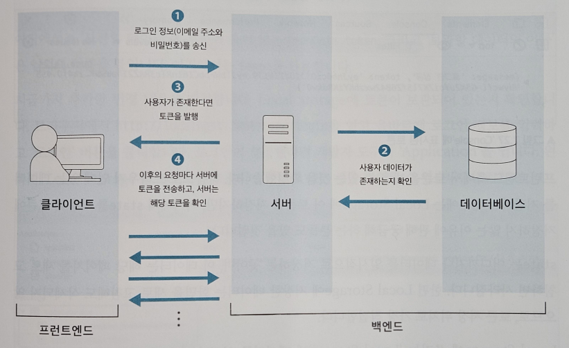

[nextjs15]: readme.md
[][nextjs15]
 
### INDEX

<table>
  <tr>
    <td><a href="small_01.md">1.개발도구   </a></td>
    <td><a href="small_02.md">2.BE준비    </a></td>
    <td><a href="small_03.md">3.B아이템   </a></td>
    <td><a href="small_04.md">4.B사용자   </a></td>
    <td><a href="small_05.md">5.BE배포    </a></td>
    <td><a href="small_06.md">6.FE준비    </a></td>
    <td><b href="small_07.md">7.F사용자   </b></td>
    <td><a href="small_08.md">8.F아이템   </a></td>
    <td><a href="small_09.md">9.FE배포    </a></td>
    <td><a href="small_10.md">10.브러시업  </a></td>
  </tr>
</table>

---
# S07. 사용자등록 및 로그인
- [필수 폴더 및 파일](#필수-폴더-및-파일)
- [사용자 등록 페이지](#사용자-등록-페이지)
- [로그인 페이지](#로그인-페이지)

---
### 필수 폴더 및 파일

- 백엔드를 개발할 때 본 것처럼 app 폴더 안에서는 폴더명이 URL로 사용되며 코드는 그 안에 만든 route.js 파일에 작성했다. 
- 이것은 프론트엔드에서도 기본적으로 같다. 
- 한가지 차이는 파일명으로 route.js가 아니라 page.js를 사용하는 것이다. 
<br/>

[app/register/page.js]
```js
const Register = () => {
  return (
    <div>
      <h1>사용자 등록</h1>
    </div>
  );
}

export default Register;
```

`URL` http://localhost:3000/register


- app 안의 폴더명이 URL로 사요오디고, 코드는 그 안에 만든 page.js에 기술할 수 있는 것을 확인
- user 폴더(사용자관련)와 itemp 폴더(아이템관련)를 aap 폴더안에 만든다
  - register 폴더는 사용자 관련 페이지이므로, user 폴더로 이동한다.
  - item 폴더 안에 create, read, update, delete 폴더를 만들고 그 안에 page.js 파일을 작성 

<br/>

[[TOP]](#index)

---
### 사용자 등록 페이지

브라우저의 표시를 담당하는 코드를 작성한 뒤, 백엔드에 데이터를 게시하는 기능을 추가 <br/>

[app/user/register/page.js]
```js
"use client" 
import { useState } from "react"

const Register = () => {
    const [name, setName] = useState("") 
    const [email, setEmail] = useState("")
    const [password, setPassword] = useState("")

    const handleSubmit = async(e) => {
        e.preventDefault()  
        try{
            const response = await fetch(`${process.env.NEXT_PUBLIC_URL}/api/user/register`, {
                method: "POST",
                headers: { 
                    "Accept": "application/json", 
                    "Content-Type": "application/json"
                },
                body: JSON.stringify({ 
                    name: name,
                    email: email,
                    password: password
                })
            }) 
            const jsonData = await response.json() 
            alert(jsonData.message) 
        }catch{
            alert("사용자 등록 실패") 
        }
    }

    return (
        <div>
            <title>등록 페이지</title>     
            <meta name="description" content="등록 페이지입니다."/>
            <h1 className="page-title">사용자 등록</h1>
            <form onSubmit={handleSubmit}>
                <input value={name} onChange={(e) => setName(e.target.value)} type="text" name="name" placeholder="이름" required/> 
                <input value={email} onChange={(e) => setEmail(e.target.value)} type="text" name="email" placeholder="메일 주소" required/>
                <input value={password} onChange={(e) => setPassword(e.target.value)} type="text" name="password" placeholder="비밀번호" required/>
                <button>등록</button>
            </form> 
        </div>
    )
}

export default Register
```
<br/>

`URL` http://localhost:3000/user/register 


<br/>

[[TOP]](#index)

---
### 로그인 페이지

로그인 페이지에서 수행하는 조작은 지금까지 만든 등록 페이지와 거의 같다. <br/>

[app/user/login/page.js]
```js
"use client"
import { useState } from "react"

const Login = () => {
    const [email, setEmail] = useState("") 
    const [password, setPassword] = useState("")

    const handleSubmit = async(e) => {
        e.preventDefault()
        try{
            const response = await fetch(`${process.env.NEXT_PUBLIC_URL}/api/user/login`, {
                method: "POST",
                headers: { 
                    "Accept": "application/json", 
                    "Content-Type": "application/json"
                },
                body: JSON.stringify({
                    email: email,
                    password: password
                })
            })
            const jsonData = await response.json() 
            localStorage.setItem("token", jsonData.token) 
            alert(jsonData.message) 
        }catch{
            alert("로그인 실패")
        }
    }
    
    return (
        <div>
            <title>로그인 페이지</title>     
            <meta name="description" content="로그인 페이지입니다."/>
            <h1 className="page-title">로그인</h1>
            <form onSubmit={handleSubmit}>
                <input value={email} onChange={(e) => setEmail(e.target.value)} type="text" name="email" placeholder="메일 주소" required/>
                <input value={password} onChange={(e) => setPassword(e.target.value)} type="text" name="password" placeholder="비밀번호" required/>
                <button>로그인</button>
            </form>
        </div>
    )
}

export default Login
```

- 로그인 페이지도 클라이언트 컴포넌트로 사용할 것이므로 첫번째 줄에 "use client" 코드를 추가
- 데이터를 입력하는 입력필드와 버튼을 추가
- 입력된 데이터를 저장하는 state를 준비
- 각각을 <input>에 추가하고 입력된 데이터를 email과 password에 써 넣는다. 
- 데이터를 백엔드에 보내는 기능을 만들고 이 기능을 <form>에 연결
- 데이터 송신에는 다시 fetch()를 사용
  - 로그인 데이터 송신지는 http://localhost:3000/api/user/login 이므로, 괄호안에 해당 내용을 기술
  - 데이터 송신 관련 설정을 작성하는 headers, 핵심인 데이터는 body에 설정
  - 여기에서도 송신 데이터는 JSON 형식이어야 하므로 JSON.stringify()를 사용해 변환
- 백엔드에서 보낸 응답을 확인
  - 응답 데이터 저장을 위한 response 를 준비
  - 이 응답은 JSON 형식으로 변환해야 하므로 json()을 추가
- JSON 데이터로의 변환은 응답 처리가 완료된 후 실행할 것이므로 await를 기술 <br/>
  await를 사용하기 위한 async도 함께 추가
- 이제 백엔드의 응답 데이터를 jsonData에 저장
  - alert()를 사용해 브라우저에 응답데이터를 표시
  - 에러 발생시 사용할 alert()를 추가
- 현재 상태에서 <button>을 클릭하면 새로 고칩된다.
- 변경된 내용을 저장하고 브라우저에서 http://localhost:3000/user/login 을 열고, 데이터베이스에 저장되어 있는 올바른 이메일 주소와 비밀번호를 입력한다.
- 이후 `로그인` 버튼을 클릭한다.
<br/>


<br/>
[로그인 상태 유지 구조]<br/>

- 가장 먼저 프론트엔드에 측에서 토큰을 받을 수 있는지 확인
- console.log(jsonData) 를 추가해 프론트엔드 측에서 토큰을 받을수 있는 것을 확인
- 데이터를 저장하는 경우에는 Local Storage에 저장한 데이터는 화면을 새로고침해도 삭제되지 않으므로, 토큰 저장 위치로 가장 적절
- Local Storage에 쓰기는 localStorage.setItem()을 사용
- console.log()는 필요하지 않으므로, 확인만 한후 이후 삭제
- `보관할 데이터` 는 토큰에 들어 있는 jsonData.token, 그리고 `보관할데이터의 이름`은 임의의 이름을 붙인다. 여기서는 token을 사용
- Local Storage에 보관되어 있는 토큰을 프론트엔드에서의 요청과 함께 백엔드에 보내면 로그인 상태를 유지할 수 있다. 
- 다음을 진행하기 전에 백엔드 측 /api/user/login/route.js의 console.log(token)은 이후 필요하지 않으므로 삭제
- 이것으로 사용자 등록페이지와 로그인페이지를 완성했다.


[app/api/user/login/route.js]
```js
import { NextResponse } from "next/server"
import { SignJWT } from "jose"  
import connectDB from "../../../utils/database"
import { UserModel } from "../../../utils/schemaModels"  

export async function POST(request){
    const reqBody = await request.json()
    try{
        await connectDB()
        const savedUserData = await UserModel.findOne({email: reqBody.email}) 
        if(savedUserData){
            // 사용자가 존재할 때의 처리
            if(reqBody.password === savedUserData.password){
                // 비밀번호가 올바를 때의 처리

                const secretKey = new TextEncoder().encode("next-market-app-book") 

                const payload = {
                    email: reqBody.email 
                }

                const token = await new SignJWT(payload)
                                        .setProtectedHeader({alg: "HS256"})
                                        .setExpirationTime("1d")
                                        .sign(secretKey)
                                        
                return NextResponse.json({message: "로그인 성공", token: token})
            }else{
                // 비밀번호가 올바르지 않을 때의 처리
                return NextResponse.json({message: "로그인 실패: 비밀번호가 올바르지 않습니다."})
            }
        }else{
            // 사용자 데이터가 존재하지 않을 때의 처리
            return NextResponse.json({message: "로그인 실패: 사용자를 등록해 주십시오."})
        }
    }catch{
        return NextResponse.json({message: "로그인 실패"}) 
    } 
}

```
<br/>

🚀 여러 항목을 포함하는 state 작성방법 <br/>
- 지금까지 /register/page.js 와 /login/page.js 에서는 데이터마다 state를 준비했다.
- 하지만 여러 데이터를 하나의 state 안에 모아서 작성할 수도 있다. 

[app/user/register/page.js]
```js
const Register = () => {
    const [name, setName] = useState("") 
    const [email, setEmail] = useState("")
    const [password, setPassword] = useState("")
})
```

- 이제까지는 state에 데이터를 써넣는 setName()이나 setPassword() 등은 <input> 안에 인라인 형식으로 기술했다. 
- 이를 하나로 모으고 싶을때는 handleChange를 만든다. 

[app/user/register/page.js]
```js
"use client" 
import { useState } from "react"

const Register = () => {
  const [newUser, setNewUser] = useState({
    name: "",
    email: "",
    password: ""
  })
  
  const handleChange = () = {}   // 추가

  const handleSubmit = async(e) => {
  ....................

}
```

[app/user/register/page.js]
```js
  <input value={ newUser.name } onChange={ handleChange } type="text" name="name" placeholder="이름" required/> 
  <input value={ newUser.email } onChange={ handleChange } type="text" name="email" placeholder="메일 주소" required/>
  <input value={ newUser.password } onChange={ handleChange } type="text" name="password" placeholder="비밀번호" required/>

```

- handleChange 안에서 state로 데이터를 써 넣는다. <br/>
  각각의 데이터 쓰기는 setNewUser()가 수행한다.

[app/user/register/page.js]
```js
  const handleChange = (e) = {
    setNewUser({
      ...newUser, 
      [e.target.name]: e.target.value,
    })
  }   
  
```

- 여기에서 newUser 앞에 사용한 ...는 스프레드 구분이라 부른다.
  - newUser와 같이 여러 데이터를 가진 데이터의 덩어리를 분할하고, 각 항목에 새로운 데이터를 쓸 때 사용
  - 백엔드로 보내는 데이터는 모두 newUser라는 state에 들어 있으므로 fetch() 안의 body는 다음과 같이 보낸다. 

```js
  body: JSON.stringify(newUser)
```

- 이해하기 쉽게 사용은 했지만, 이방법은 잘 사용하지 않는다. 그냥 이런 표기법도 있다는 정도만 숙지!!


<br/>

[[TOP]](#index)

---
