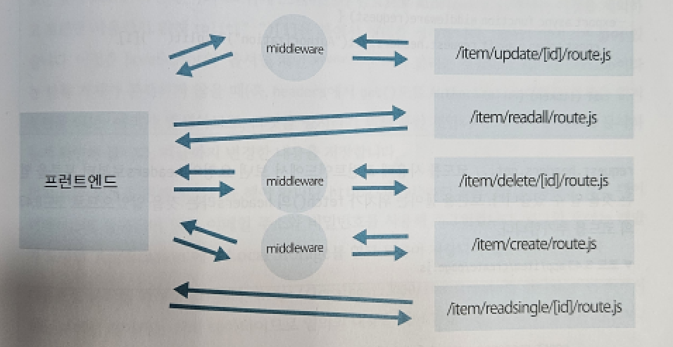

[nextjs15]: readme.md
[][nextjs15]
 
### INDEX

<table>
  <tr>
    <td><a href="small_01.md">1.개발도구   </a></td>
    <td><a href="small_02.md">2.BE준비    </a></td>
    <td><a href="small_03.md">3.B아이템   </a></td>
    <td><a href="small_04.md">4.B사용자   </a></td>
    <td><a href="small_05.md">5.BE배포    </a></td>
    <td><a href="small_06.md">6.FE준비    </a></td>
    <td><a href="small_07.md">7.F사용자   </a></td>
    <td><b href="small_08.md">8.F아이템   </b></td>
    <td><a href="small_09.md">9.FE배포    </a></td>
    <td><a href="small_10.md">10.브러시업  </a></td>
  </tr>
</table>

---
# S08. 아이템 페이지
- [전체 아이템 데이터를 읽는 페이지](#전체-아이템-데이터를-읽는-페이지)
- [1개 아이템 데이터를 읽는 페이지](#1개-아이템-데이터를-읽는-페이지)
- [아이템 데이터 작성 페이지](#아이템-데이터-작성-페이지)
- [아이템 데이터 수정 페이지](#아이템-데이터-수정-페이지)
- [아이템 데이터 삭제 페이지](#아이템-데이터-삭제-페이지)
- [페이지 표시를 제어하기](#페이지-표시를-제어하기)
- [스타일 적용과 공통 컴포넌트](#스타일-적용과-공통-컴포넌트)

---
### 전체 아이템 데이터를 읽는 페이지

[app/page.js]
```js

import Link from "next/link"
import Image from "next/image"

const getAllItems = async() => {
    const response = await fetch(`${process.env.NEXT_PUBLIC_URL}/api/item/readall`, {cache: "no-store"})
    const jsonData = await response.json()
    const allItems = jsonData.allItems
    return allItems
}

const ReadAllItems = async() => {
    const allItems = await getAllItems()
    return (
        <div className="grid-container-in">
            <title>NextMarket</title>     
            <meta name="description" content="NextMarketです"/>
            {allItems.map(item => 
                <Link href={`/item/readsingle/${item._id}`} key={item._id}>
                    <Image src={item.image} width={750} height={500} alt="item-image" priority/>
                    <div key={item._id}> 
                        <h2>¥{item.price}</h2>
                        <h3>{item.title}</h3>
                        <p>{item.description.substring(0, 80)}...</p>  
                    </div>
                </Link>
            )}
        </div>
    )
} 

export default ReadAllItems
```
- 이 코드에서는 데이터를 게시하는 것이 아니라 얻어야 하므로, 게시할 데이터를 넣는 body나 header는 설저할 필요가 없다.
- method 또한 fetch()가 아니라 데이터를 얻는 GET 요청이 기본이기 때문에 method: "GET"과 같이 평시할 필요가 없다. 
- 얻은 데이터를 포함하고 있는 response의 내용을 확일할 것이므로 console.log를 기술
- `URL` http://localhost:3000 을 열고, 개발자 도구의 `Console`을 확인
  - 모든 아이템 데이터를 얻을 수 있고, 얻은 데이터는 jsonData에 들어 있다
  - 클라이언트가 아닌 서버 컴포넌트이기 때문에 console.log() 실행결과는 브라우저의 `Console`에는 표시되지 않고 터미널에서만 표시된다는 점
<br/>

[[TOP]](#index)

---
### 1개 아이템 데이터를 읽는 페이지

백엔드를 개발할 때와 마찬가지로 특수한 폴더명인 [id]를 사용한다 <br/>
<br/>

[app/item/readsingle/[id]/page.js]
```js
import Image from "next/image"  
import Link from "next/link" 

const getSingleItem = async(id) => {
    const response = await fetch(`${process.env.NEXT_PUBLIC_URL}/api/item/readsingle/${id}`, {cache: "no-store"})
    const jsonData = await response.json() 
    const singleItem = jsonData.singleItem
    return singleItem 
}  

const ReadSingleItem = async(context) => {
    const singleItem = await getSingleItem(context.params.id)
    return (
        <div className="grid-container-si">
            <title>{singleItem.title}</title>     
            <meta name="description" content={singleItem.description}/>
            <div>
                <Image src={singleItem.image} width={750} height={500} alt="item-image" priority/>
            </div>
            <div>
                <h1>{singleItem.title}</h1>
                <h2>¥{singleItem.price}</h2>
                <hr/>
                <p>{singleItem.description}</p>
                <div>
                    <Link href={`/item/update/${singleItem._id}`}>아이템 수정</Link>
                    <Link href={`/item/delete/${singleItem._id}`}>아이템 삭제</Link>
                </div>
            </div>
        </div>
    )
}

export default ReadSingleItem
```
- 고정된 폴더명을 사용하면 아이템 수만큼 폴더가 늘어나 효율이 떨어지므로, <br/>
  백엔드와 마찬가지로 범용적인 템플릿 폴더를 만들고 거기에 개별 아이템 데이터를 전달해 표시
- 접속한 프론트엔드 URL에서 끝의 문자열을 얻어 fetch()를 사용해 백엔드의 URL에 붙이면 필요한 아이템 데이터를 얻을 수 있다. 
- URL 끝의 데이터는 Next.js에서 사용하는 특별한 코드인 context의 내부, params의 id이다. 
- `URL` http://localhost:3000/item/readsingle/ 뒤에 무작위 문자열을 추가하고 브라우즈 오픈
- URL의 끝은 context.params.id 로 얻을 수 있음
- 코드상에서 getSingleItem에 전달하고, 전달된 context.params.id를 받을 것이므로 id를 괄호안에 추가
- 문자열을 작성하는 큰따옴표(" ") 또는 작은따옴프(' ') 안에 JavaScript의 코드는 기술할수 없다.
  - 따라서 여기서 사용하는 것은 백틱(backtick)과 같은 ${ }이다.
  - URL 전체를 백틱으로 싸고 아래와 같이 기술
    - `fetch(http://localhost:3000/api/item/readsingle/${id})`
- 백엔드에서 받은 response에 들어 있는 데이터는 JSON으로 변환해야 한다.
  - 변환 작업은 데이터를 모두 얻은 뒤 수행해야 하므로 await와 async를 코드에 추가
  - 얻은 데이터를 확인하기 위해 console.log()도 추가
    - `console.log(jsonData.singleItem)`
- 각 아이템 데이터를 브라우저에서 표시
  - async, await, 캐시를 저장하지 않도록 하는 코드도 fetch()안에 추
```js
const getSingleItem = async(id) => {
    const response = await fetch(`${process.env.NEXT_PUBLIC_URL}/api/item/readsingle/${id}`, {cache: "no-store"})    // 추가
    const jsonData = await response.json() 
    console.log(jsonData.singleItem)    // 삭제
    const singleItem = jsonData.singleItem    // 추가
    return singleItem     // 추가
}  

const ReadSingleItem = async(context) => {    // 추가
    const singleItem = await getSingleItem(context.params.id)    // 추가
    console.log(singleItem)    // 추가
    return(
      ..................
```

- 브라우저에서 데이터를 표시
  - 작업은 각 아이템으로 분할하는 map()이 없는 것을 제외하고 /app/page.js 와 거의 같다.
  - Next.js의 <Image>를 임포트해서 사용
<br/>

[[TOP]](#index)

---
### 아이템 데이터 작성 페이지

데이터 게시 기능을 개발한 뒤 Local Storage와 연동하는 기능 추가
<br/>

[app/item/create/page.js]
```js
"use client"
import { useState } from "react"
import { useRouter } from "next/navigation" 
import useAuth from "../../utils/useAuth"
import ImgInput from "../../components/imgInput"

const CreateItem = () => {
    const [title, setTitle] = useState("")
    const [price, setPrice] = useState("")
    const [image, setImage] = useState("")
    const [description, setDescription] = useState("")

    const router = useRouter()
    const loginUserEmail = useAuth() 

    const handleSubmit = async(e) => {
        e.preventDefault() 
        try{
            const response = await fetch(`${process.env.NEXT_PUBLIC_URL}/api/item/create`, {
                method: "POST",
                headers: { 
                    "Accept": "application/json", 
                    "Content-Type": "application/json",
                    "Authorization": `Bearer ${localStorage.getItem("token")}`
                },
                body: JSON.stringify({
                    title: title,
                    price: price,
                    image: image,
                    description: description,
                    email: loginUserEmail  
                })
            })
            const jsonData = await response.json()
            alert(jsonData.message)  
            router.push("/") 
            router.refresh()
        }catch{
            alert("아이템 작성 실패") 
        }
    }

    if(loginUserEmail){
        return (
            <div>
                <title>작성 페이지</title>     
                <meta name="description" content="작성 페이지입니다."/>
                <h1 className="page-title">아이템 작성</h1>
                <ImgInput setImage={setImage}/>
                <form onSubmit={handleSubmit}>
                    <input value={title} onChange={(e) => setTitle(e.target.value)} type="text" name="title" placeholder="아이템명" required/>
                    <input value={price} onChange={(e) => setPrice(e.target.value)} type="text" name="price" placeholder="가격" required/>
                    <input value={image} onChange={(e) => setImage(e.target.value)} type="text" name="image" placeholder="이미지" required/>
                    <textarea value={description} onChange={(e) => setDescription(e.target.value)} name="description" rows={15} placeholder="상품 설명" required></textarea>
                    <button>작성</button>
                </form>
            </div>
        )
    }  
}

export default CreateItem
```
- 이 컴포넌트는 클라이언트 컴포넌트로 사용할 것이므로 첫번째 줄에 "use client"를 기술
- 아이템 데이터를 입력받는 각 항목을 만든다
- 입력된 각 항목의 데이터를 보관하는 state를 만든다
- <input>과 <textarea>에 입력된 데이터를 각 state에 보관
- 다음은 데이터 송신 처리를 수행하는 handleSubmit을 만들고 <form>과 연결
- 실패했을 때의 처리를 기술하기 위한 try catch, 데이터 캐시를 위한 fetch()도 추가
- 아이템 데이터 게시 대상은 백엔드 http://localhost:3000/api/item/create 이므로 fetch()에 기술
  - 데이터 송신 관련 설정은 headers에 기술하고, 보낼 데이터는 body에 넣는다
  - 데이터는 JSON 형식으로 보낼것이므로 JSON.stringify()를 잊지 않도록한다
- 백엔드 데이터에는 title, price 같은 항목뿐만 아니라 email도 있음
  - 이 email 데이터는 후반에 만들 `사용자 로그인 기능을 프론토엔드 측에서 판정하는 파일(useAuth.hs)` 에서 얻는다.  
  - 여기서는 우선 email 항목을 만들고 아래와 같이 기술
    - email: "더미 데이터"    // 추가  
- 아이템 작성이 성공하면 alert()를 표시한 뒤, 홈페이지로 이동
  - Next.js에서 제공하는 next/navigation을 사용
- 마지막으로 처리 완료를 기다리는 await와 async, 브라우저의 새로 고침을 방지하는 preventDefault()를 기술
- 이 아이템 작성 페이지가 툭수한 점은, 로그인한 사용자 아이템을 작성할 수 있다는 점때문이다. 
  - 아이템 작성, 편집 및 삭제 요청은 middleware.js를 통과하여 유효한 토큰이 있는지 확인  
  - 그렇기 때문에 이 아이템 게시 페이지에서 백엔드로 데이터를 보낼때는 토큰도 함께 보내야 한다.
- 아이템 작성 성공이라는 알람이 뜨고 홈페이지로 이동했다면, MongoDB를 열어보고 확인


<br/>

[/middleware.js]
```js
import { NextResponse } from "next/server"
import { jwtVerify } from "jose" 

export async function middleware(request){
    const token = await request.headers.get("Authorization")?.split(" ")[1]

    if(!token){
        return NextResponse.json({message: "토큰 없음"})
    }

    try{
        const secretKey = new TextEncoder().encode("next-market-app-book") 
        const decodedJwt = await jwtVerify(token, secretKey) 
        return NextResponse.next()
    }catch{
        return NextResponse.json({message: "토큰이 올바르지 않으므로 로그인하십시오"})
    }
}

export const config = {
    matcher: ["/api/item/create", "/api/item/update/:path*", "/api/item/delete/:path*"],
}
```

<br/>

[[TOP]](#index)

---
### 아이템 데이터 수정 페이지

수정페이지는 내용이 가장 많고 `하나의 아이템 데이터를 읽는 페이지`와 `아이템 데이터를 작성하는 페이지`를 합친것이다. <br/>
  - 하나의 아이템 데이터를 읽고, 그 데이터가 <input>과 <textarea>에 표시
  - `하나의 아이템 데이터를 읽는 페이지`는 서버 컴포넌트, `아이템 데이터를 작성하는 페이지`는 클라이언트 컴포넌트 였다.
    - 서버 컴포넌트로 전체 구조를 프레임을 만들고, 데이터 게시 부분만 잘라서 클라이언트 코드로 만드는 방법도 가능
    - 이해하기 쉽게 전체를 클라이언트 컴퍼넌트로 만드는 방법도 가능
<br/>

[app/item/update/[id]/page.js]
```js
"use client"
import { useState, useEffect } from "react"
import { useRouter } from "next/navigation" 
import useAuth from "../../../utils/useAuth"

const UpdateItem = (context) => {
    const [title, setTitle] = useState("")
    const [price, setPrice] = useState("")
    const [image, setImage] = useState("")
    const [description, setDescription] = useState("")
    const [email, setEmail] = useState("")
    const [loading, setLoading] = useState(false) 

    const router = useRouter()
    const loginUserEmail = useAuth() 

    useEffect(() => {
        const getSingleItem = async(id) => {
            const response = await fetch(`${process.env.NEXT_PUBLIC_URL}/api/item/readsingle/${id}`, {cache: "no-store"})
            const jsonData = await response.json() 
            const singleItem = jsonData.singleItem
            setTitle(singleItem.title)
            setPrice(singleItem.price)
            setImage(singleItem.image)
            setDescription(singleItem.description)
            setEmail(singleItem.email) 
            setLoading(true) 
        }  
        getSingleItem(context.params.id) 
    }, [context]) 

    const handleSubmit = async(e) => {
        e.preventDefault() 
        try{
            const response = await fetch(`${process.env.NEXT_PUBLIC_URL}/api/item/update/${context.params.id}`, {
                method: "PUT",
                headers: { 
                    "Accept": "application/json", 
                    "Content-Type": "application/json",
                    "Authorization": `Bearer ${localStorage.getItem("token")}`
                },
                body: JSON.stringify({
                    title: title,
                    price: price,
                    image: image,
                    description: description,
                    email: loginUserEmail    
                })
            })
            const jsonData = await response.json()
            alert(jsonData.message)  
            router.push("/") 
            router.refresh()
        }catch{
            alert("아이템 수정 실패") 
        }
    }

    if(loading){   
        if(loginUserEmail === email){ 
            return (
                <div>
                    <title>수정 페이지</title>     
                    <meta name="description" content="수정 페이지입니다."/>
                    <h1 className="page-title">아이템 수정</h1>
                    <form onSubmit={handleSubmit}>
                        <input value={title} onChange={(e) => setTitle(e.target.value)} type="text" name="title" placeholder="아이템명" required/>
                        <input value={price} onChange={(e) => setPrice(e.target.value)} type="text" name="price" placeholder="가격" required/>
                        <input value={image} onChange={(e) => setImage(e.target.value)} type="text" name="image" placeholder="이미지" required/>
                        <textarea value={description} onChange={(e) => setDescription(e.target.value)} name="description" rows={15} placeholder="상품 설명" required></textarea>
                        <button>수정</button>
                    </form>
                </div>
            )
        }else{                            
            return <h1>권한이 없습니다.</h1>  
        }  
    }else{                          
        return <h1>로딩 중...</h1> 
    }   
}

export default UpdateItem
```
- 데이터를 작성하는 프로세스와 완전히 같으므로, /create/page.js 를 복사해서 /update/[id]/page.js에 복붙하고 `작성`을 `수정`으로 변경
- 그리고 하나의 아이템데이터 읽기 코드를 추가한다. 
- useEffect 는 특정 시점에 실행할 조작이 있을때 사용한다. 
  - 수정 페이지의 경우 `페이지 수정 전에 아이템 데이터를 읽는` 조작이다
  - 데이터 취득은 item/readsingle/[id]/page.js 에 있는 getSingleItem 과 같은 코드로 가능하므로, 복사해서 useEffect 안에 붙여 넣는다
  - <input>과 <textarea>의 데이터는 value와 같으며, 현대 state의 데이터(title, price 등)가 들어 있다
  - 얻은 데이터를 각 state에 써 넣으면 <input>과 <textarea>에 표시된다
  - return 부분만 삭제
- 이메일 데이터 추가
  - 아이템 데이터에 있는 이메일 주소를 보관할 state
  - `const [email, setEmail] = useState("")`
  - getSingleItem을 호출해 실행하는 코드를 작성
  - 괄호 안에는 URL 끝의 문자열을 포함하고 있는 context.params.id를 넣어야 하므로 context를 잊지말것
  - 그리고 useEffect의 동작을 1회로 제한하는 [context]도 추가
- 작성페이지를 가져온후 `작성`을 `수정`으로 변경
- `URL` http://localhost:3000/api/item/update/XXXXX 
- 끝의 XXXXX에는 수정할 아이템의 _id가 들어가야 하고, 이것은 context에 들어 있으므로 백틱을 사용할 것
- 그리고 method도 PUT으로 변경
<br/>

[[TOP]](#index)

---
### 아이템 데이터 삭제 페이지

삭제 페이지의 흐름은 수정 페이지의 흐름과 거의 동일<br/>
<br/>

[app/item/delete/[id]/page.js]
```js
"use client"
import { useState, useEffect } from "react"
import { useRouter } from "next/navigation" 
import Image from "next/image"   
import useAuth from "../../../utils/useAuth"

const DeleteItem = (context) => {
    const [title, setTitle] = useState("")
    const [price, setPrice] = useState("")
    const [image, setImage] = useState("")
    const [description, setDescription] = useState("")
    const [email, setEmail] = useState("")
    const [loading, setLoading] = useState(false) 

    const router = useRouter()
    const loginUserEmail = useAuth() 

    useEffect(() => {
        const getSingleItem = async(id) => {
            const response = await fetch(`${process.env.NEXT_PUBLIC_URL}/api/item/readsingle/${id}`, {cache: "no-store"})
            const jsonData = await response.json() 
            const singleItem = jsonData.singleItem
            setTitle(singleItem.title)
            setPrice(singleItem.price)
            setImage(singleItem.image)
            setDescription(singleItem.description)
            setEmail(singleItem.email) 
            setLoading(true)  
        }  
        getSingleItem(context.params.id) 
    }, [context]) 

    const handleSubmit = async(e) => {
        e.preventDefault() 
        try{
            const response = await fetch(`${process.env.NEXT_PUBLIC_URL}/api/item/delete/${context.params.id}`, {
                method: "DELETE",
                headers: { 
                    "Accept": "application/json", 
                    "Content-Type": "application/json",
                    "Authorization": `Bearer ${localStorage.getItem("token")}`
                },
                body: JSON.stringify({
                    email: loginUserEmail 
                })
            })
            const jsonData = await response.json()
            alert(jsonData.message)  
            router.push("/") 
            router.refresh()
        }catch{
            alert("아이템 삭제 실패") 
        }
    }

    if(loading){  
        if(loginUserEmail === email){ 
            return (
                <div>
                    <title>삭제 페이지</title>     
                    <meta name="description" content="삭제 페이지입니다."/>
                    <h1 className="page-title">아이템 삭제</h1>
                    <form onSubmit={handleSubmit}>
                        <h2>{title}</h2>
                        <Image src={image} width={750} height={500} alt="item-image" priority/>
                        <h3>¥{price}</h3>
                        <p>{description}</p>
                        <button>삭제</button>
                    </form>
                </div>
            )   
        }else{                 
            return <h1>권한이 없습니다.</h1> 
        }     
    }else{                     
        return <h1>로딩 중...</h1>     
    }   
}

export default DeleteItem
```
- 삭제 페이지에서는 얻은 데이터를 표시하기 위한 <input>과 <textarea>를 사용할 필요 없다.
- 그리고 <image> 임포트해서 사용
- `수정`이라는 문자는 `삭제`로 변경하고, UpdateItem은 DeleteItem으로 변경
- 마지막에 수정해야 할 부분은 handleSubmit 내부이다
  - fetch()의 URL은 백엔드에서 삭제를 수행하는 /api/item/delete/XXXXX가 되므로 /update를 /delete로 수정
- 백엔드에 보내는 데이터 부분
  - title과 price 등은 보낼 필요 없음
  - 백엔드에서는 프론트엔드에서 보내진 요청 안의 email과 삭제할 아이템 데이터의 email을 초대하는 프로세스가 있으므로 email은 남긴 채로 백엔드로 보내야 한다.
- 마지막으로 수정페이지와 삭제페이지에 대한 링크를 `하나의 아이템 데이터를 읽는 페이지`에 추가
<br/>

[[TOP]](#index)

---
### 페이지 표시를 제어하기

사용자 로그인 상태에 따라 표시할 페이지를 제한하는 기능을 개발 
- 현재 시점에서 아이템 작성,수정,삭제 페이지에 누구나 접근할 수 있다
- 로그인 하지 않은 사람에게 작성 페이지를 표시하지 않도록 제한
- 해당 아이템의 작성자가 아닌 사람에게 수정 페이지와 삭제 페이지를 표시하지 않도록 제한
<br/>

[app/utils/useAuth.js]
```js
import { useState, useEffect } from "react" 
import { useRouter } from "next/navigation"
import { jwtVerify } from "jose" 

const useAuth = () => {
    const [loginUserEmail, setLoginUserEmail] = useState("")

    const router = useRouter() 

    useEffect(() => {   
        const checkToken = async() => { 
            const token = localStorage.getItem("token")

            if(!token){
                router.push("/user/login")
            }

            try{
                const secretKey = new TextEncoder().encode("next-market-app-book") 
                const decodedJwt = await jwtVerify(token, secretKey) 
                setLoginUserEmail(decodedJwt.payload.email)  
            }catch{
                router.push("/user/login")
            }
        }
        checkToken() 
    }, [router]) 

    return loginUserEmail 
}

export default useAuth
```
- 가정 먼저 사용자가 로그인했는지 확인
  - Local Storage를 보면 알수 있다
    - ` const token = localStorage.getItem("token") `
  - 토큰(token)이 있으면 로그인한 상태, 없으면 로그인하지 않은 상태
  - !token은 'Not token', 즉 토큰이 없다는 의미
  - 토큰이 없을 때는 로그인을 하도록 할것이므로 로그인 페이지로 이동시켜 준다
<br/>

- 토큰이 있으면 해당 토큰이 유효한지 확인해야 한다
  - 먼저 토큰이 유효할때와 유효하지 않을때의 대응을 위해 try catch를 추가
  - 토큰의 유효성을 확인할 때는 jwtVerify()와 시크릿키가 필요
  - 여기에서는 middleware.js에서 사용하는 것과 같은 시크릿키가 필요
  - 토큰 해석 코드를 기술 
    - ` const secretKey = new TextEncoder().encode("next-market-app-book")  `
  - 토큰이 유효하다면 verify()에서 해석되고, 유효하지 않으면 에러가 발생해 catch 에서 처리
    - ` const decodedJwt = await jwtVerify(token, secretKey)   `
  - 유효한 토큰을 해석한 데이터는 decodedJws에 들어 있다
  - 이 안에는 payload로서 사용자의 이메일 주소가 있으므로 이후 확인해보자 
<br/>

- 해석 후의 데이터인 decodedJwt에 들어 있는 이메일 주소의 활용
  - 수정 페이지와 삭제 페이지를 표시하는 제한에 사용
  - 해석한 토큰 안에 있는 로그인 사용자의 이메일 주소를 코드에서 loginUserEmail 안에 써 넣는다
    - ` setLoginUserEmail(decodedJwt.payload.email) `
  - useAuth.js의 처리가 수행되는 시점은 
    - 작성과 수정 페이지에 접근했을때, 가장 먼저 처리가 되어야 한다
    - 페이지가 표시되기 전에 수행할 처리에는 useEffect를 사용한다
    - useEffect를 임포트 한 뒤 우선 실행할 처리를 {} 안에 기술한다
    - 마지막 []에는 router를 쓴다

- jwtVerify()의 제대로 동작하지 않는 문제
  - 얼핏보면 코드가 의도한 대로 동작할 것 같지만 사실은 문제가 있음
  - middleware.js 에서 보면 jwtVerify() 앞에 await가 있다
    - await가 없으면 그 아래의 코드가 먼저 실행되기 때문
    - 따라서 useEffect 안에 await, 그리고 async를 추가해야 한다
    - 하지만 ` useEffect(async() => { ... ` 와 같은 형태로 useEffect에 직접 async를 붙일 수는 없다.
    - 아래와 같이 코드 추가하면, 이제 jwtVerify()가 올바르게 실행하게 된다.

```js

    useEffect(() => {   
        const checkToken = async() => {     // 추가
            const token = localStorage.getItem("token")

            if(!token){
                router.push("/user/login")
            }

            try{
                const secretKey = new TextEncoder().encode("next-market-app-book") 
                const decodedJwt = await jwtVerify(token, secretKey)   // 추가
                setLoginUserEmail(decodedJwt.payload.email)    
            }catch{
                router.push("/user/login")
            }
        }
        checkToken()   // 추가
    }, [router]) 

    return loginUserEmail 
}

export default useAuth
```
<br/>

- 마지막으로 이 파일을 처리한 결과, 즉 로그인 사용자의 이메일 주소가 들어 있는 loginUserEmail을 다른 파일에서 사용할 수 있게 되므로 리턴해줘야 한다
  - ` return loginUserEmail  `

<br/>

[[TOP]](#index)

---
### 스타일 적용과 공통 컴포넌트

CSS, Header, Footer 를 추가해 애플리케이션을 완성한다 <br/>
- 유지보수 측면에서 공통부분을 따로 만든다
- 그것을 필요한 페이지에서 임포트하여 사용
- app 폴더 안에 components 폴더 생성후 관리
<br/>

*️⃣ CSS 생성 <br>
- 다음 CSS코드를 모두 복사하고 app 폴더의 globals.css에 붙여넣는다

[app/globals.css]
```css
@import url("https://fonts.googleapis.com/css2?family=Noto+Sans+JP:wght@300;400&display=swap");

/* Common style */
html, body, div, span, applet, object, iframe, h1, h2, h3, h4, h5, h6, p, blockquote, pre, a, abbr, acronym, address, big, cite, code, del, dfn, em, img, ins, kbd, q, s, samp, small, strike, strong, sub, sup, tt, var, b, u, i, center, dl, dt, dd, ol, ul, li, fieldset, form, label, legend, table, caption, tbody, tfoot, thead, tr, th, td, article, aside, canvas, details, embed, figure, figcaption, footer, header, hgroup, menu, nav, output, ruby, section, summary, time, mark, audio, video {
  margin: 0;
  padding: 0;
  border: 0;
  font-size: 100%;
  font: inherit;
  vertical-align: baseline;
}

html{
  font-size: 62.5%;
}

body{
  font-family: "Noto Sans JP", sans-serif;
  font-weight: 300;
  color: #333;
  max-width: 1100px; 
  margin-right: auto; 
  margin-left:  auto;
  padding-right: 1.5rem; 
  padding-left:  1.5rem;
}

h1{
  font-size: 3rem;
  font-weight: 400;
  line-height: 3.5rem;
}

h2{
  font-size: 2.4rem;
  font-weight: 400;
  line-height: 3rem;
}

h3{
  font-size: 2rem;
  font-weight: 400;
  line-height: 3rem;
}

p{
  font-size: 1.8rem;
  line-height: 3.5rem;
  margin-bottom: 1.4rem;
}

a{
  text-decoration: none;
}

.page-title{
  margin: 3rem 0 4rem;
  text-align: center;
}

/* Form */
input, textarea{
  width: 100%;
  padding: 0.5rem;
  margin-bottom: 2rem;
  border: 0.1rem solid #ccc;
  border-radius: 0.5rem;
  box-sizing: border-box;
  resize: vertical;
  font-size: 1.6rem;
  letter-spacing: 0;
  font-family: inherit;
}

button{
  background: #858585;
  font-size: 1.6rem;
  color: #fff;
  padding: 0.6rem;
  border: none;
  border-radius: 0.5rem;
  cursor: pointer;
  width: 100%;
}

button:hover{
  opacity: 0.8;
  background: linear-gradient(135deg,#FF63A4,#FFD873);
}

/* Header */
header * img{
  width: 100%;  
  height: auto;
}

header * li{
  display: inline;
}

nav{
  text-align: end;
  margin: 2rem 0 2.2rem;
}

header * li a{
  padding: 0.3rem 1.7rem;
  margin-left: 1rem;
  border-radius: 0.5rem;
  background-image: linear-gradient( -20deg, #646464 0%, #646464 80%, #FFD873 80%, #FFD873 80%);
  color: #fff;
  font-size: 1.6rem;
  font-weight: 400;
}

header * li a:hover{
  opacity: 0.8;
  transition: all 0.3s;
}

@media(max-width: 400px){ 
  header * li a{
    padding: 0.2rem 1.4rem;
    font-size: 1.2rem;
  }
} 

/* Index */
.grid-container-in{
  display: grid;
  grid-template-columns: 1fr 1fr 1fr;
  gap: 3rem;
}

@media(max-width: 600px){ 
  .grid-container-in{
      grid-template-columns: 1fr;
  }
} 

.grid-container-in > a {
  display: block;
  border-radius: 1rem;
  width: 100%;
  border: 0.05rem solid rgb(223, 223, 223);
}

.grid-container-in > a:hover{
  backdrop-filter: blur(2rem);
  box-shadow: 0.4rem 0.4rem 1.3rem 0.5rem rgba(0,0,0,0.25);
  transition: all 0.3s;
}

.grid-container-in > a * img, .grid-container-in > a > img{
  width: 100%;
  height: auto;
  border-radius: 1rem 1rem 0 0; 
}

.grid-container-in > * > div {
  padding: 1.5rem 1.5rem;
  color: #333;
}

.grid-container-in > * > div  > h2{
  color: #FF63A4;
  margin-bottom: 0.4rem;
}

.grid-container-in > * > div  > p{
  margin-bottom: 0;
}

/* Single Item */
.grid-container-si{
  display: grid;
  grid-template-columns: 0.6fr 0.4fr;
  gap: 2rem;
}

@media(max-width: 600px){ 
  .grid-container-si{
      grid-template-columns: 1fr;
  }
} 

.grid-container-si * img{
  border-radius: 1rem;
  width: 100%;
  height: auto;
}

.grid-container-si h2{
  color: #FF63A4;
  margin: 1rem 0 2rem; 
}

.grid-container-si hr{
  margin: 1.5rem 0; 
}

.grid-container-si * a{
  padding: 0.3rem 1.7rem;
  margin-right: 1rem;
  border-radius: 0.5rem;
  background-image: linear-gradient( -20deg, #646464 0%, #646464 80%, #FF63A4 80%, #FF63A4 80%);
  color: rgb(255, 255, 255);
  font-size: 1.6rem;
  font-weight: 400;
}

.grid-container-si * a:hover{
  opacity: 0.8;
  transition: all 0.3s;
}

@media(max-width: 400px){ 
  .grid-container-si * a{
    padding: 0.2rem 1.4rem;
    font-size: 1.2rem;
  }
}

/* Delete Item */
.delete-page * img{
  border-radius: 1rem;
}

.delete-page * h1{
  margin-bottom: 1.5rem;
}

.delete-page * h2{
  margin: 1rem 0;
}

/* Img Form */
.img-input{
  display: grid;
  grid-template-columns: 0.8fr 0.2fr;
  gap: 1rem;
}

.img-input > input{
  display: block;
  background-color: rgb(221, 221, 221);
  padding: 0.4rem 0 0 0.5rem;
}

.img-input > button{
  padding: 0;
  font-size: 1.4rem;
  margin-bottom: 2rem;
  height: 3.6rem;
  background: #858585;
}

.img-input > button:hover{
  opacity: 0.8;
  background: linear-gradient(135deg,#FF63A4,#FFD873);
}

.img-input >button:disabled, .img-input > button[disabled]{
  background: #858585;
  color: rgb(165, 165, 165);
}

.img-input >button:disabled, .img-input > button[disabled]:hover{
  opacity: 1;
  cursor: not-allowed;
}

@media(max-width: 400px){ 
  .img-input{
    grid-template-columns: 1fr;
    gap: 0rem;
  }
  .img-input > button{
    margin: -1rem 0 3rem;
    height: 3rem;
  }
}

/* Create Item */
/* Update Item */
/* Register */
/* Login */

/* Footer */
footer{
  text-align: center;
  margin: 3rem 0;
}

```
<br/>

*️⃣ Header 생성 <br>

[app/component/header.js]
```js
import Image from "next/image"
import Link from "next/link"

const Header = () => {
    return (
        <header>
            <div>
                <Link href="/">
                    <Image src="/header.svg" width={1330} height={148} alt="header-image" priority/>
                </Link>
            </div>
            <nav>
                <ul>
                    <li><Link href="/user/register">등록</Link></li>
                    <li><Link href="/user/login">로그인</Link></li>
                    <li><Link href="/item/create">아이템 작성</Link></li>
                </ul>
            </nav>
        </header>
    )
}

export default Header
```
<br/>


*️⃣ Footer 생성 <br>

[app/component/footer.js]
```js
const Footer = () => {
    return (
        <footer>
            <p>@{new Date().getFullYear()} Next Market</p>
        </footer>
    )
}

export default Footer
```
<br/>

[[TOP]](#index)

---
