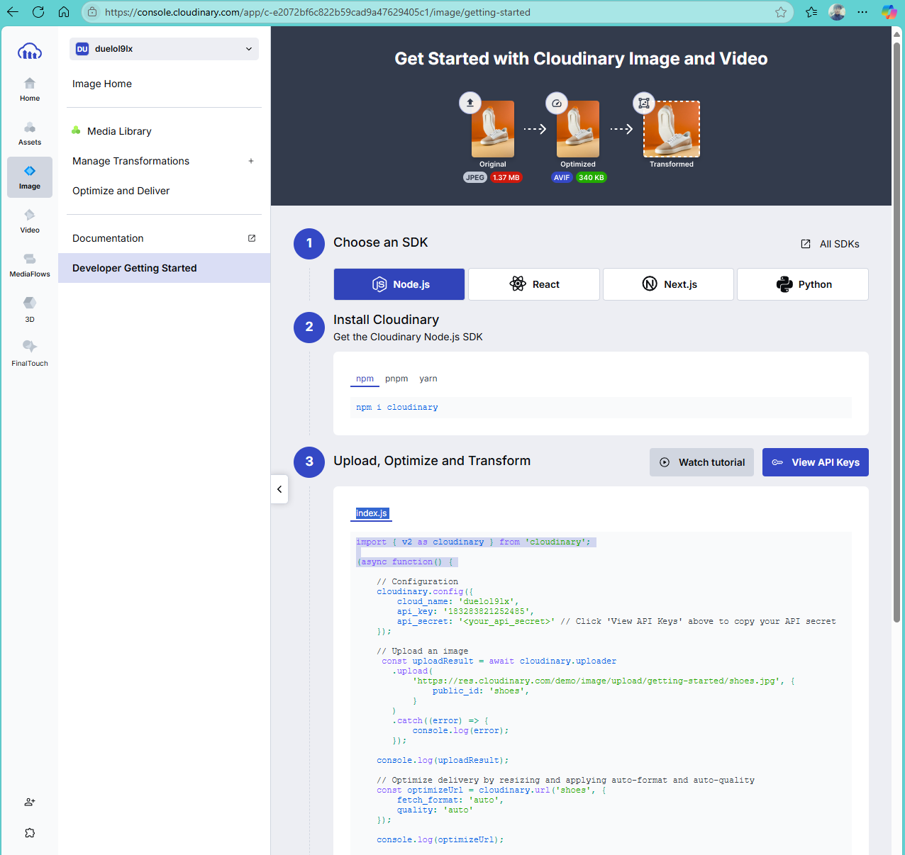
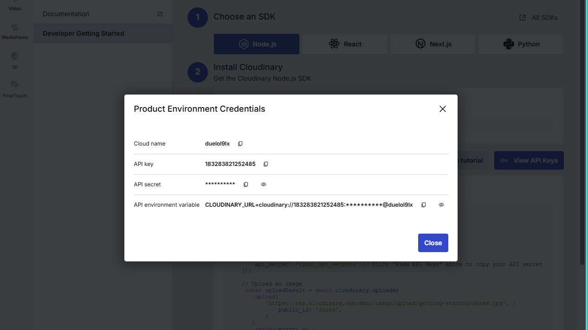

[nextjs15]: readme.md
[][nextjs15]
 
### INDEX

<table>
  <tr>
    <td><a href="small_01.md">1.개발도구   </a></td>
    <td><a href="small_02.md">2.BE준비    </a></td>
    <td><a href="small_03.md">3.B아이템   </a></td>
    <td><a href="small_04.md">4.B사용자   </a></td>
    <td><a href="small_05.md">5.BE배포    </a></td>
    <td><a href="small_06.md">6.FE준비    </a></td>
    <td><a href="small_07.md">7.F사용자   </a></td>
    <td><a href="small_08.md">8.F아이템   </a></td>
    <td><a href="small_09.md">9.FE배포    </a></td>
    <td><b href="small_10.md">10.브러시업  </b></td>
  </tr>
</table>

---
# S10. 브러시업
- [이미지 업로드 기능 개발](#이미지-업로드-기능-개발)
- [로딩](#로딩)
- [메타 데이터 설정 방법](#메타-데이터-설정-방법)
- [이후의 학습에 관해](#이후의-학습에-관해)

---
### 이미지 업로드 기능 개발

이미지 업로드 기능을 앱에 추가하여 사용자가 원하는 이미지를 저장 할 수 있다. 

- 앞에서 개발한 애플리케이션의 아이템 사진에는 public 폴더의 이미지를 사용했다.
- 하지만 여기서에서는 사용자가 원하는 사진을 애플리케이션에 표시하게 할 수 없으므로, 클라우드 서비스인 Cloudinary를 사용해 애플리케이션에 이미지 업로드 기능을 추가한다.
- 먼저 Cloudinary에 사용자 등록을 한다. 
- `URL` https://cloudinary.com/ 
<br/>





```js
    // Configuration
    cloudinary.config({ 
        cloud_name: 'duelol9lx', 
        api_key: '183283821252485', 
        api_secret: '<your_api_secret>' // Click 'View API Keys' above to copy your API secret
    });

```

- 인증 이메일을 클릭해 로그인하면 대시보드 화면으로 이동한다. 
- 여기에서 표시는 'cloud_name'은 이후 필요하므로 어딘가에 복사해 둔다.

- Cloudinary 설정
  - 왼쪽 메뉴 아래쪽 Settings 아이콘 클릭
  - 이미지 업로드 관련 설정을 수행하는 `Upload Presets`를 클릭
  - 업로드 설정을 추가하거나 변경할 수 있다. 
  - 여기에서 새로운 설정을 추가한다.
  - 화면 오른쪽 위 `Add Upload Preset`을 클릭
  - 새로운 이미지 업로 설정 정보를 입력
  - `Upload preset name`은 임의로 설정
  - `Signing mode`는 `Unsigned`로 설정 -> 로그인하지않은 사용자도 이미지를 업로드 가능
  - 다른 항목은 그대로 두고 화면 오른쪽 위 `Save` 버튼을 클릭
  - 이미지 업로드 설정이 추가

<br/>

[app/components/imgInput.js]
```js
import { useState } from "react"

const ImgInput = (props) => {
    const [imageFile, setImageFile] = useState("")

    const handleClick = async() => {
        try{
            const data = new FormData()
            data.append("file", imageFile)
            data.append("upload_preset", "upclpe2")
            data.append("cloud_name","6fs9n32")
            const response= await fetch("https://api.cloudinary.com/v1_1/6fs9n32/image/upload", {method: "POST", body: data})
            const jsonData = await response.json()
            await props.setImage(jsonData.url)
            alert("이미지 업로드 성공")
        }catch{
            alert("이미지 업로드 실패")
        }
    }
    return (
        <div className="img-input">
            <input type="file" onChange={(e)=> setImageFile(e.target.files[0])} accept="image/png, image/jpg"/>
            <button onClick={handleClick} disabled={!imageFile}>이미지 업로드</button>
        </div>
    )
}

export default ImgInput
```
<br/>

- imgInput.js를 등록페이지에서 임포트

[app/item/create/page.js]
```js
"use client"
import { useState } from "react"
import { useRouter } from "next/navigation" 
import useAuth from "../../utils/useAuth"
import ImgInput from "../../components/imgInput"

const CreateItem = () => {
    const [title, setTitle] = useState("")
    const [price, setPrice] = useState("")
    const [image, setImage] = useState("")
    const [description, setDescription] = useState("")

    const router = useRouter()
    const loginUserEmail = useAuth() 

    const handleSubmit = async(e) => {
        e.preventDefault() 
        try{
            const response = await fetch(`${process.env.NEXT_PUBLIC_URL}/api/item/create`, {
                method: "POST",
                headers: { 
                    "Accept": "application/json", 
                    "Content-Type": "application/json",
                    "Authorization": `Bearer ${localStorage.getItem("token")}`
                },
                body: JSON.stringify({
                    title: title,
                    price: price,
                    image: image,
                    description: description,
                    email: loginUserEmail  
                })
            })
            const jsonData = await response.json()
            alert(jsonData.message)  
            router.push("/") 
            router.refresh()
        }catch{
            alert("아이템 작성 실패") 
        }
    }

    if(loginUserEmail){
        return (
            <div>
                <title>작성 페이지</title>     
                <meta name="description" content="작성 페이지입니다."/>
                <h1 className="page-title">아이템 작성</h1>
                <ImgInput setImage={setImage}/>
                <form onSubmit={handleSubmit}>
                    <input value={title} onChange={(e) => setTitle(e.target.value)} type="text" name="title" placeholder="아이템명" required/>
                    <input value={price} onChange={(e) => setPrice(e.target.value)} type="text" name="price" placeholder="가격" required/>
                    <input value={image} onChange={(e) => setImage(e.target.value)} type="text" name="image" placeholder="이미지" required/>
                    <textarea value={description} onChange={(e) => setDescription(e.target.value)} name="description" rows={15} placeholder="상품 설명" required></textarea>
                    <button>작성</button>
                </form>
            </div>
        )
    }  
}

export default CreateItem
```

- imgInput.js에 setImage를 props로 전달하고, 이미지 업로드가 완료되면 imgInput.js에서 state의 image가 변경되도록 되어 있다. 
- `URL` http://localhost:3000/item/create 를 열면 이미지 업로드하는 부분이 표시된다
  - 원하는 이미지를 선택하고 `이미지 업로드` 버튼을 클릭하면 Cloudinary에 이미지가 업로드 된다.
  - 성공하면 `이미지 업로드 성공`이라고 표시되고, 표시되지 않았을 때는 에러발생 가능성 있음

- MongoDB에는 /img2.jpg와 같이 public 폴더에 대한 경로 저장
- 이것을 Cloudinary에 저장된 이미지의 URL로 치환할 것이므로 아이템 작성 페이지(/app/item/create/page.js)에서 publick 폴더 안의 이미지를 모두 Cloudinary에 업로드 한다
- 여기에서는 이미지를 업로드해 URL을 취득할수만 있으면 되기 때문에 `아이템 작성` 버튼을 클릭해 MongoDB에 데이터를 써 넣을 필요는 없다. 

- Next.js의 <Image>에서 외부 URL 이미지를 표시하게 하려면 약간의 설정이 필요. 아래파일에 코드 추가

[next.config.mjs]
```js
"use client"
import { useState } from "react"
import { useRouter } from "next/navigation" 
import useAuth from "../../utils/useAuth"
import ImgInput from "../../components/imgInput"

const CreateItem = () => {
    const [title, setTitle] = useState("")
    const [price, setPrice] = useState("")
    const [image, setImage] = useState("")
    const [description, setDescription] = useState("")

    const router = useRouter()
    const loginUserEmail = useAuth() 

    const handleSubmit = async(e) => {
        e.preventDefault() 
        try{
            const response = await fetch(`${process.env.NEXT_PUBLIC_URL}/api/item/create`, {
                method: "POST",
                headers: { 
                    "Accept": "application/json", 
                    "Content-Type": "application/json",
                    "Authorization": `Bearer ${localStorage.getItem("token")}`
                },
                body: JSON.stringify({
                    title: title,
                    price: price,
                    image: image,
                    description: description,
                    email: loginUserEmail  
                })
            })
            const jsonData = await response.json()
            alert(jsonData.message)  
            router.push("/") 
            router.refresh()
        }catch{
            alert("아이템 작성 실패") 
        }
    }

    if(loginUserEmail){
        return (
            <div>
                <title>작성 페이지</title>     
                <meta name="description" content="작성 페이지입니다."/>
                <h1 className="page-title">아이템 작성</h1>
                <ImgInput setImage={setImage}/>
                <form onSubmit={handleSubmit}>
                    <input value={title} onChange={(e) => setTitle(e.target.value)} type="text" name="title" placeholder="아이템명" required/>
                    <input value={price} onChange={(e) => setPrice(e.target.value)} type="text" name="price" placeholder="가격" required/>
                    <input value={image} onChange={(e) => setImage(e.target.value)} type="text" name="image" placeholder="이미지" required/>
                    <textarea value={description} onChange={(e) => setDescription(e.target.value)} name="description" rows={15} placeholder="상품 설명" required></textarea>
                    <button>작성</button>
                </form>
            </div>
        )
    }  
}

export default CreateItem
```

<br/>

[[TOP]](#index)

---
### 로딩

<br/>

[[TOP]](#index)

---
### 메타 데이터 설정 방법

<br/>

[[TOP]](#index)

---
### 이후의 학습에 관해

<br/>

[[TOP]](#index)

---
