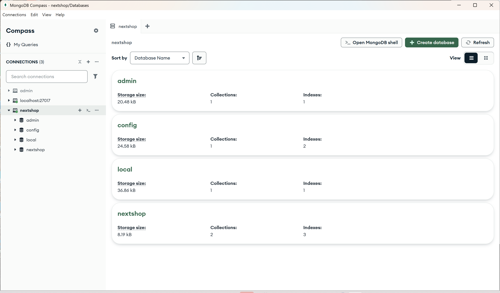

[nextjs15]: readme.md
[][nextjs15]
 
### INDEX

<table>
  <tr>
    <td><a href="small_01.md">1.개발도구   </a></td>
    <td><a href="small_02.md">2.BE준비    </a></td>
    <td><a href="small_03.md">3.B아이템   </a></td>
    <td><a href="small_04.md">4.B사용자   </a></td>
    <td><a href="small_05.md">5.BE배포    </a></td>
    <td><a href="small_06.md">6.FE준비    </a></td>
    <td><a href="small_07.md">7.F사용자   </a></td>
    <td><a href="small_08.md">8.F아이템   </a></td>
    <td><a href="small_09.md">9.FE배포    </a></td>
    <td><a href="small_10.md">10.브러시업  </a></td>
  </tr>
</table>

---
# Mongo DB 
<!--
- [MongoDB란?](#mongodb란)
- [핵심 개념](#-mongodb의-핵심-개념)
- [주요 특징](#-mongodb의-주요-특징)
- [사용 예시 (CRUD)](#-사용-예시-crud)
- [어디에 쓰이나요?](#️-어디에-쓰이나요)
- [MongoDB의 유형](#️-mongodb의-유형)
-->
- [MongoDB란?](#mongodb란)
- [MongoDB Compass](#mongodb-compass)
- [MongoDB 드라이버 연결](#mongodb-드라이버-연결)
- [Next.js에서 MongoDB 연결](#nextjs에서-mongodb-연결)

---
### MongoDB란?
MongoDB는 전통적인 RDBMS와는 다른 방식으로 데이터는 저장하는 **NoSQL 데이터베이스** 
<br/>
🌐 공식사이트 : [[MongoDB Atlas]](https://www.mongodb.com/ko-kr/docs/manual/)
<br/>

### 🧠 MongoDB의 핵심 개념
- Document: JSON과 유사한 BSON(Binary JSON) 형식으로 저장되는 데이터 단위
- Collection: 여러 Document를 담는 그릇, RDB의 테이블과 비슷
- Database: 여러 Collection을 포함하는 상위 개념

### 💡 MongoDB의 주요 특징
- 스키마 유연성: 미리 정해진 구조 없이 다양한 형태의 데이터를 저장 가능
- 확장성: 수평 확장이 쉬워서 대용량 데이터 처리에 유리
- 빠른 읽기/쓰기 성능: 특히 읽기 속도가 빠르고, 인덱스를 다양하게 지원
- 분산 시스템 지원: Replica Set, Sharding 등으로 고가용성과 확장성 확보

### 🔧 사용 예시 (CRUD) 
```javascript
// Create
db.users.insertOne({ name: "Jace", age: 28 });

// Read
db.users.find({ age: { $gt: 20 } });

// Update
db.users.updateOne({ name: "Jace" }, { $set: { age: 29 } });

// Delete
db.users.deleteOne({ name: "Jace" });
```

### ⚓️ 어디에 쓰이나요?
- 실시간 분석 시스템
- IoT 데이터 저장
- 사용자 프로필, 게시글, 채팅 로그 등 유연한 구조가 필요한 서비스


### ☁️ MongoDB의 유형

<table>
  <tr>
    <td>MongoDB</td>
    <td>
      로컬 환경, 즉 로컬 PC안에 데이터를 저장
    </td>
  </tr>
  <tr>
    <td>MongoDB Atlas</td>
    <td>
      클라우드, 즉 온라인에 데이터를 저장
    </td>
  </tr>
</table>

<!--
 ☁️ MongoDB 설치형 (On-Premise 또는 자체 서버) 
| 항목 | 설명 | 
|-----|-----| 
| 설치 및 운영 | 사용자가 직접 설치, 구성, 유지보수 필요 | 
| 유연성 | 서버, 설정, 보안 등 모든 것을 직접 제어 가능 | 
| 비용 | 서버 비용, 인프라 유지비, 인건비 발생 | 
| 확장성 | 수동 확장 필요 (샤딩, 클러스터 구성 등) | 
| 보안 | 직접 구성해야 하며, 실수 시 취약점 발생 가능 | 
| 백업/복구 | 직접 스크립트 작성 또는 외부 도구 사용 필요 | 
| 적합한 경우 | 고도의 커스터마이징이 필요한 환경, 내부망 전용 시스템 등 | 

☁️ MongoDB Atlas (클라우드 관리형 서비스)
| 항목 | 설명 | 
|-----|-----| 
| 설치 및 운영 | MongoDB에서 자동으로 관리 (배포, 패치, 모니터링 등) | 
| 유연성 | 설정은 제한적이지만 대부분의 기능은 UI로 쉽게 조작 가능 | 
| 비용 | 사용량 기반 과금 (무료 플랜도 존재) | 
| 확장성 | 버튼 클릭만으로 수평/수직 확장 가능 | 
| 보안 | 기본적으로 TLS, IP 화이트리스트, 암호화 등 제공 | 
| 백업/복구 | 자동 백업 및 복원 기능 내장 | 
| 적합한 경우 | 빠른 개발, 스타트업, DevOps 리소스가 부족한 팀 등 | 

**유형별 비교**
-->

| 항목 | MongoDB 설치형 | MongoDB Atlas |
|-----|---------------|---------------|  
| 형태        | On-Premise 또는 자체 서버            | 클라우드 관리형 서비스  |
| 설치 및 운영 | 사용자가 직접 설치, 구성, 유지보수 필요 | MongoDB에서 자동으로 관리 (배포, 패치, 모니터링 등) | 
| 유연성      | 서버, 설정, 보안 등 모든 것을 직접 제어 가능  | 설정은 제한적이지만 대부분의 기능은 UI로 쉽게 조작 가능 | 
| 비용        | 서버 비용, 인프라 유지비, 인건비 발생        | 사용량 기반 과금 (무료 플랜도 존재) | 
| 확장성      | 수동 확장 필요 (샤딩, 클러스터 구성 등)      | 버튼 클릭만으로 수평/수직 확장 가능 | 
| 보안        | 직접 구성해야 하며, 실수 시 취약점 발생 가능 | 기본적으로 TLS, IP 화이트리스트, 암호화 등 제공 | 
| 백업/복구    | 직접 스크립트 작성 또는 외부 도구 사용 필요  | 자동 백업 및 복원 기능 내장 | 
| 적합한 경우  | 고도의 커스터마이징이 필요한 환경, 내부망 전용 시스템 등 | 빠른 개발, 스타트업, DevOps 리소스가 부족한 팀 등 | 
- `MongoDB Atlas`는 편리함과 자동화에 초점이 맞춰져 있고, 인프라 관리에 시간을 쓰고 싶지 않다면 최고의 선택!
- 직접 `설치형 MongoDB`는 제어권과 유연성이 필요할 때 유리하지만, 관리 부담이 크다!
<br/>

[[TOP]](#index)

---
### MongoDB Compass
MongoDB Compass는 MongoDB 공식 GUI 클라이언트로, 데이터를 시각적으로 조회, 수정, 분석할 수 있게 도와주는 도구 <br/>
<br/>

1️⃣ MongoDB Compass로 로컬 서버 접속 방법 <br/>

```plaintext
mongodb://localhost:27017
```
→ 브라우즈에서 열면 아래와 같은 Client GUI창이 새롭게 오픈


<br/>

2️⃣ MongoDB 실행 여부 GUI로 확인 <br/>
- Compass 접속 성공 → MongoDB 서버 정상 작동 중
- 접속 실패 → 서버가 꺼져 있거나 포트 설정, 인증 문제가 있을 수 있어요
- Compass에서 각 데이터베이스 및 컬렉션 확인 가능
  - 데이터 쿼리
  - 삽입/수정/삭제
  - 인덱스 조회
  - 성능 분석까지 가능!
<br/>

3️⃣ MongoDB 서버가 꺼져 있을 경우 <br/>
Compass는 클라이언트이기 때문에 MongoDB 서버가 실행 중이어야 해요. 서버 실행 여부는 다음으로 확인 가능:

```shell
netstat -ano | findstr :27017
```
→ 결과가 나오면 MongoDB가 27017 포트에서 실행 중이라는 의미이다!!
<br/>

4️⃣ GUI를 통한 데이터 쿼리
1. 컬렉션 선택 : Compass 접속 후 원하는 데이터베이스 → 컬렉션 클릭 <br/>
  (예: `mydatabase` → `users`) <br/>

2. 필터(Query) 입력
컬렉션 화면의 "Filter" 입력창에서 조건을 JSON 형식으로 입력

```json
{ "age": { "$gte": 25 } }
```

✨ 자주 쓰는 예시 <br/>
| 조건 | 쿼리 예제 | 
|-----|----------| 
| 특정 값 | { "name": "Jace" } | 
| 범위 검색 | { "age": { "$gte": 20, "$lte": 30 } } | 
| 존재 여부 | { "email": { "$exists": true } } | 
| 배열 조건 | { "tags": { "$in": ["korean", "frontend"] } } | 
| AND 조건 | { "age": { "$gte": 18 }, "active": true } | 
| OR 조건 | { "$or": [ { "age": 18 }, { "active": true } ] } | 

<br/>

3. 정렬 & 제한
  - **Sort** 입력창 : `{ "age": -1 }` → 나이 순 내림차순 정렬
  - **Limit** : 몇 개까지 보여줄지 설정 (예: `100`)
  - **Project** : 특정 필드만 보여주기 <br/>
    예: `{ "name": 1, "email": 1, "_id": 0 }` → 이름과 이메일만 표시하고 ID는 제외 <br/>

💡 팁 <br/>
- 쿼리 입력 시 문법 오류가 나면 Compass가 빨간 경고를 보여준다. (실시간 문법 체크!)
- 쿼리 조건 저장 기능도 있어 자주 사용하는 검색을 빠르게 다시 사용할 수 있다.
- Compass는 단지 조회뿐 아니라, Insert, Update, Delete도 GUI로 지원한다.

<br/>

[[TOP]](#index)

---
### MongoDB 드라이버 연결
1. 드라이버와 버전을 선택 : Node.js ver6.7 이상
2. 드라이버 설치 : `npm install mongodb`
3. 연결 문자열을 애플리케이션 코드에 추가
```shell
mongodb+srv://jacekimtheal:<db_password>@cluster-jacekim.8pqgjqy.mongodb.net/?retryWrites=true&w=majority&appName=cluster-jacekim
```
☑ <db_password>를 jacekimtheal 데이터베이스 사용자 의 비밀번호로 바꾸세요. <br/>
☑ 모든 옵션 매개변수가 URL로 인코딩 되었는지 확인하세요 <br/>

⏯ 애플리케이션에서 연결 예시 (Node.js)
```js
const { MongoClient } = require('mongodb');
const uri = 'mongodb+srv://<username>:<password>@<cluster>.mongodb.net/?retryWrites=true&w=majority';
const client = new MongoClient(uri);
await client.connect();
```
<br/>

[[TOP]](#index)

---
### Next.js에서 MongoDB 연결
> 가장 많이 사용되는 방식은 MongoDB Atlas + MongoClient 조합


#### ⏯ Next.js 13 이상에서 App Router를 사용 (app)

📁 디렉터리 구조 예시 (app 기반)
```shell
/my-next-app
├── app
│   └── api
│       └── test
│           └── route.js
├── lib
│   └── mongodb.js
├── .env.local
```

1. `.env.local` 설정
```js
MONGODB_URI=mongodb+srv://<username>:<password>@<cluster>.mongodb.net/mydb?retryWrites=true&w=majority
```

2. `lib/mongodb.js` – MongoDB 연결 유틸
```js
import { MongoClient } from 'mongodb';

const uri = process.env.MONGODB_URI;
const options = {};

let client;
let clientPromise;

if (!process.env.MONGODB_URI) {
  throw new Error('MONGODB_URI 환경 변수가 설정되지 않았습니다.');
}

if (process.env.NODE_ENV === 'development') {
  if (!global._mongoClientPromise) {
    client = new MongoClient(uri, options);
    global._mongoClientPromise = client.connect();
  }
  clientPromise = global._mongoClientPromise;
} else {
  client = new MongoClient(uri, options);
  clientPromise = client.connect();
}

export default clientPromise;
```

3. `app/api/test/route.js` – API Route (App Router 방식)
```js
import clientPromise from '@/lib/mongodb';

export async function GET() {
  try {
    const client = await clientPromise;
    const db = client.db('mydb');
    const collection = db.collection('test');
    const data = await collection.find({}).toArray();

    return Response.json({ data });
  } catch (error) {
    return Response.json({ error: 'DB 연결 실패' }, { status: 500 });
  }
}
```

4. 참조사이트
- [MongoDB 공식 튜토리얼](https://www.mongodb.com/developer/languages/javascript/nextjs-with-mongodb/)
- [velog.io :: Next.js 에서 MongoDB 연결 방법](https://velog.io/@sham/Next.js%EB%A1%9C-%EC%9D%B4%EA%B2%83%EC%A0%80%EA%B2%83-5-Next.js%EC%97%90%EC%84%9C-%EB%AA%BD%EA%B3%A0DB-%EC%8B%9C%EC%9E%91%ED%95%98%EA%B8%B0-with-Atlas)

<br/>

[[TOP]](#index)

---
#### ⏯ Next.js 12 이전에서 App Router를 사용 (pages)

📁 디렉터리 구조 예시 (pages 기반)
```shell
/my-next-app
├── lib
│   └── mongodb.js
├── pages
│   └── api
│       └── test.js
├── .env.local
├── package.json
```

1. `.env.local` 파일 설정
```js
MONGODB_URI=mongodb+srv://<username>:<password>@<cluster>.mongodb.net/mydb?retryWrites=true&w=majority
```

2. `lib/mongodb.js` – MongoDB 연결 유틸
```js
import { MongoClient } from 'mongodb';

const uri = process.env.MONGODB_URI;
const options = {};

let client;
let clientPromise;

if (!process.env.MONGODB_URI) {
  throw new Error('MONGODB_URI 환경 변수가 설정되지 않았습니다.');
}

if (process.env.NODE_ENV === 'development') {
  if (!global._mongoClientPromise) {
    client = new MongoClient(uri, options);
    global._mongoClientPromise = client.connect();
  }
  clientPromise = global._mongoClientPromise;
} else {
  client = new MongoClient(uri, options);
  clientPromise = client.connect();
}

export default clientPromise;
```

3. `pages/api/test.js` – API 라우트에서 사용
```js
import clientPromise from '../../lib/mongodb';

export default async function handler(req, res) {
  const client = await clientPromise;
  const db = client.db('mydb');
  const collection = db.collection('test');

  const data = await collection.find({}).toArray();
  res.status(200).json({ data });
}
```

4. 참조사이트
- [MongoDB 공식 튜토리얼](https://www.mongodb.com/developer/languages/javascript/nextjs-with-mongodb/)
- [velog.io :: Next.js 에서 MongoDB 연결 방법](https://velog.io/@k_ddaddi/Next%EC%97%90-MongoDB-%EC%97%B0%EA%B2%B0%ED%95%98%EA%B8%B0)


<br/>

[[TOP]](#index)

---
### Docker 컨테이너에서 MongoDB 실행

docker pull mongo      
docker create mongo
docker ps -a
dcoker run --name <<container_name>> -d -p 27203:27017 mongo
mongodb://localhost:27203

mongodb 이미지를 다운
mongodb 컨테이너 설치
버턴 클릭하여 docker 실행

DockerFile을 Build하여 Run하여 사용
DockerHub : docker 저장소이며 image를 다운받아 사용
https://hub.docker.com


내 컴퓨터에 드라이버만 잡아주고 나머지 설정은 자동으로 되도록 누군가가 이미지를 만들어 놨다.
도커 이미지를 만들어 놔서 거기에다가 이미 설정을 다 해놨다. 
누가? 엔비디아가 해놓고 공식적으로 제공한다. 
그렇게 공식적으로 제공한 이미지를 다운로드 받아서 그 이미지를 실행만 시키면 된다.
내가 따로 설정할 필요가 1도 없다. 

먼저 Docker를 다운로드 받는다.
`도커 데스크톱 설치` 구글링


<br/>

[[TOP]](#index)

---